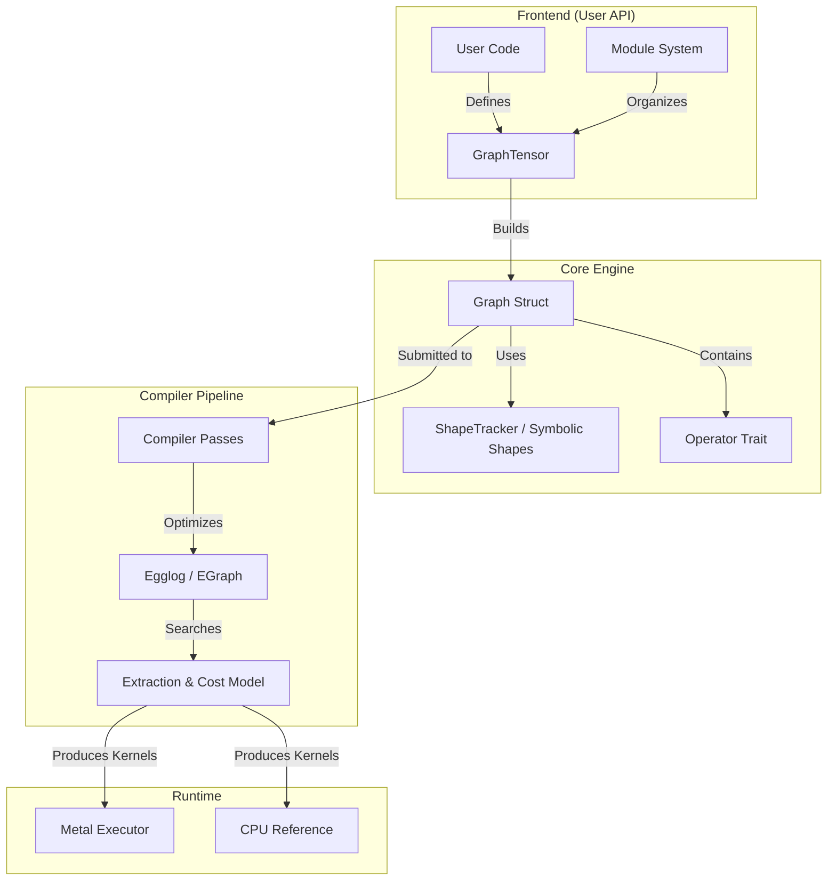

# Luminal Developer Guide

Welcome to the Luminal developer documentation. Luminal is a deep learning compiler framework designed to optimize computational graphs via equality saturation (using `egglog`) and execute them efficiently on hardware (primarily Apple Silicon via Metal).

This guide provides a high-level architectural overview of the library.

---

## Architecture Overview

Luminal operates in three distinct phases: **Construction**, **Compilation**, and **Execution**.



---

## 1. The Graph Engine
The core of Luminal is the **Graph**, which acts as both the definition of the neural network and the runtime state.

*   **[Graph (`graph.rs`)](#luminalsrcgraphrs):** The central data structure. It holds the topology (nodes and edges), the tensor data (`Vec<f32>`), and manages the execution lifecycle.
*   **[GraphTensor (`graph_tensor.rs`)](#luminalsrcgraph_tensorrs):** The user-facing handle. A `GraphTensor` does not hold data directly; it holds a `NodeIndex` pointing to the `Graph`. It provides the fluent API for math and data loading.
*   **[Operators (`op.rs`)](#luminalsrcoprs):** Every node in the graph implements the `Operator` trait. This trait defines how to execute the node on the CPU (reference) and how to convert the node into an S-expression for the `egglog` optimizer.

### Symbolic Shapes
Unlike many frameworks, Luminal uses symbolic algebra for shapes.
*   **[ShapeTracker (`shape/tracker.rs`)](#luminalsrcshapetrackerrs):** Tracks dimensions and strides. It allows for zero-copy views (permute, slice, broadcast) by manipulating symbolic expressions rather than moving memory.
*   **[Symbolic Expressions (`shape/symbolic.rs`)](#luminalsrcshapesymbolicrs):** Uses `egg` to simplify algebraic expressions (e.g., resolving `(x * 1) + 0` to `x`). This is crucial for generating efficient indexing math in GPU kernels.

---

## 2. High-Level Operations (`hl_ops`)
Luminal provides a rich set of high-level operations that users interact with. These often decompose into simpler primitive operators during graph construction.

*   **[Binary (`hl_ops/binary.rs`)](#luminalsrchl_opsbinaryrs):** Overloads `+`, `-`, `*`, `/` and implements comparisons.
*   **[Unary (`hl_ops/unary.rs`)](#luminalsrchl_opsunaryrs):** Activation functions (`relu`, `sigmoid`), math (`log`, `exp`), and normalization (`layer_norm`).
*   **[Movement (`hl_ops/movement.rs`)](#luminalsrchl_opsmovementrs):** Shape manipulation like `permute`, `reshape`, `expand`, and `gather`.
*   **[MatMul (`hl_ops/matmul.rs`)](#luminalsrchl_opsmatmulrs):** Handles matrix multiplication logic, including broadcasting and batching, by decomposing it into `Reshape` -> `Broadcast` -> `Mul` -> `SumReduce`.
*   **[Reduction (`hl_ops/reduction.rs`)](#luminalsrchl_opsreductionrs):** `sum`, `max`, `mean`.

---

## 3. The Compiler Stack
The compilation pipeline transforms the high-level graph into an optimized executable format.

### Compiler Infrastructure
*   **[Compiler Utilities (`compiler_utils.rs`)](#luminalsrccompiler_utilsrs):** Defines the `Compiler` trait. It includes the `GraphSearch` pattern matching engine, allowing developers to write passes that find and replace subgraphs (e.g., fusing `Mul` + `Add`).
*   **[Generic Optimizations (`generic_compiler.rs`)](#luminalsrcgeneric_compilerrs):** Standard passes applied to most graphs, such as Common Subexpression Elimination (CSE), Dead Code Elimination, and Arithmetic Simplification.

### Equality Saturation (Egglog)
Luminal integrates with `egglog` for advanced optimization.
1.  **Lowering:** The graph is converted to S-expressions (`op.rs`).
2.  **Saturation:** `egglog` applies rewrite rules to explore many equivalent graph versions simultaneously.
3.  **[Extraction (`extract.rs`)](#luminalsrcextractrs):** The `extract` module searches the EGraph for the most performant trajectory. It compiles candidate subgraphs to kernels, runs them on hardware to measure actual execution time, and selects the fastest version.

---

## 4. Execution & Backends
Once the graph is compiled, it is executed on the target hardware.

*   **[Metal Backend (`run.rs`)](#luminalsrcrunrs):** The primary accelerator backend. It compiles kernels to Metal Shading Language (MSL), manages GPU buffers, and executes the compute pipeline on Apple Silicon.
*   **[CPU Reference (`op.rs`)](#luminalsrcoprs):** The `Operator::process` method provides a CPU-based reference implementation for correctness checking and debugging.
*   **[Utils (`utils.rs`)](#luminalsrcutilsrs):** Helpers for constructing C-compatible structs for GPU uniform buffers and debugging graph structures.

---

## 5. Module System
*   **[Modules (`module.rs`)](#luminalsrcmodulers):** Provides the `Module` trait (similar to PyTorch `nn.Module`) for organizing neural networks. It handles parameter serialization, weight loading, and graph stitching.

---

## Documentation Index

*   [Compiler Utilities (`compiler_utils.rs`)](#luminalsrccompiler_utilsrs)
*   [Extraction & Search (`extract.rs`)](#luminalsrcextractrs)
*   [Generic Compiler (`generic_compiler.rs`)](#luminalsrcgeneric_compilerrs)
*   [Graph Engine (`graph.rs`)](#luminalsrcgraphrs)
*   [Graph Tensor (`graph_tensor.rs`)](#luminalsrcgraph_tensorrs)
*   [High-Level Ops: Binary (`hl_ops/binary.rs`)](#luminalsrchl_opsbinaryrs)
*   [High-Level Ops: MatMul (`hl_ops/matmul.rs`)](#luminalsrchl_opsmatmulrs)
*   [High-Level Ops: Movement (`hl_ops/movement.rs`)](#luminalsrchl_opsmovementrs)
*   [High-Level Ops: Other (`hl_ops/other.rs`)](#luminalsrchl_opsotherrs)
*   [High-Level Ops: Reduction (`hl_ops/reduction.rs`)](#luminalsrchl_opsreductionrs)
*   [High-Level Ops: Unary (`hl_ops/unary.rs`)](#luminalsrchl_opsunaryrs)
*   [Module System (`module.rs`)](#luminalsrcmodulers)
*   [Operators & Data (`op.rs`)](#luminalsrcoprs)
*   [Metal Runtime (`run.rs`)](#luminalsrcrunrs)
*   [Symbolic Shapes (`shape/symbolic.rs`)](#luminalsrcshapesymbolicrs)
*   [Shape Tracker (`shape/tracker.rs`)](#luminalsrcshapetrackerrs)
*   [Utilities (`utils.rs`)](#luminalsrcutilsrs)

---

# luminal/src/compiler_utils.rs

Here is the developer documentation for `luminal/src/compiler_utils.rs`. This module serves as the toolkit for writing graph compilers, optimization passes, and manipulating the computational graph.

---


## Compiler Utilities (`compiler_utils.rs`)

This module provides the core infrastructure for the Luminal compiler stack. It includes the `Compiler` trait, graph manipulation helpers, visualization tools, and a robust pattern-matching engine for identifying and fusing subgraphs.


### 1. The Compiler Trait

The core of the transformation pipeline is the `Compiler` trait. Any struct implementing this trait can act as a pass that modifies the graph.

```rust
pub trait Compiler {
    type Output;
    /// Run a compilation pass
    fn compile<T: ToIdsMut>(&self, graph: &mut Graph, ids: T) -> Self::Output;
}
```


#### Composition and Wrappers
Compilers are designed to be composed. The module provides implementations for tuples, allowing you to chain passes sequentially:

```rust
// Example: A pipeline that runs PassA, then PassB, then PassC
let pipeline = (PassA, PassB, PassC);
pipeline.compile(&mut graph, &mut tensors);
```

There are also wrapper structs to modify compiler behavior:
*   **`Looped<C>`**: Runs the inner compiler repeatedly until the graph topology stabilizes (fixed-point iteration). Useful for optimization passes that may enable further optimizations (e.g., constant folding).
*   **`Timed<C>`**: Wraps a compiler to print the execution time to stdout.


### 2. Graph Manipulation

Extensions to the `Graph` struct allow for type-safe modification and inspection of the graph.


#### Adding Operations
Use the builder pattern to add operations and define dependencies.

```rust
// Example: Adding a multiplication op
let a = cx.tensor(3);
let b_id = cx
    .add_op(luminal::op::Mul) // Create the op
    .input(a.id, 0, a.shape)  // Define input (src_node, output_idx, shape)
    .finish();                // Finalize and get NodeIndex
```


#### Node Inspection
Helper methods allow you to retrieve typed references to the underlying `Operator` trait objects.

*   `get_op::<T>(node)`: Panics if the node is not type `T`.
*   `try_get_op::<T>(node)`: Returns `Option<&T>`.
*   `check_node_type::<T>(node)`: Returns `bool`.


#### Remapping
When performing graph surgery (e.g., fusing two nodes into one), external references (like `GraphTensor` variables held by the user) must be updated to point to the new node.

The `ToIdsMut` trait and `remap` function handle this:

```rust
// Moves all references pointing to `old_node` to point to `new_node`
remap(old_node, new_node, &mut user_tensors, &mut graph);
```


### 3. Pattern Matching Engine

A significant portion of this module is dedicated to `GraphSearch`, a system for finding specific subgraphs to optimize (e.g., finding `Mul` -> `Add` to fuse into a generic operation).


#### Building a Selector
Use `SelectGraph` to define the structure you are looking for. Helper functions `op`, `unary`, and `binary` make this fluent.

```rust
// Example: Find a pattern where a Binary op feeds into a Unary op
// Pattern: (A, B) -> Binary -> Unary
let pattern = unary::<MyUnaryOp>(
    binary::<MyBinaryOp>(
        node(), // Matches any node
        node()
    )
);
```

You can add constraints to the selection:
*   `.ty::<T>()`: The node must be of type `T`.
*   `.shapes(...)`: The input shapes must match specific dimensions.
*   `.check(...)`: Run a custom closure to validate the node.


#### Searching and Replacing
Once a `SelectGraph` is built, use it to search the main graph.

```rust
let mut searcher = pattern.search(&mut graph);

// Iterate through all matches in the graph
while searcher.next_match() {
    // Get the NodeIndex in the actual graph corresponding to the pattern nodes
    let matched_op = searcher.get(&pattern_node_id);
    
    // Perform logic (e.g., check if safe to delete, add new fused op)
    if searcher.check_no_delete(&[...]) {
        // ...
    }
    
    // Update the graph
    searcher.try_delete(); // Remove matched nodes if safe
}
```


### 4. Visualization

Debugging graph compilers is difficult without visualization. This module integrates with Graphviz.

*   **`graph.display()`**: Opens the current graph structure in the browser using [GraphvizOnline](https://dreampuf.github.io/GraphvizOnline/).
*   **`graph.display_shapes()`**: Same as above, but annotates edges with tensor shapes.

To enable debug prints during compilation, set the environment variable:
`DEBUG=1`


### 5. Helper Macros

*   **`tuple_impls!`**: Internal macro used to implement `Compiler` and `ToIds` for tuples of varying sizes (up to 20 elements), enabling the pipeline composition syntax.
*   **`select_ty!`**: A macro shortcut for creating a `SelectOp` with a specific type constraint.

# luminal/src/extract.rs

Here is the developer documentation for `luminal/src/extract.rs`.


### Overview

The `extract.rs` module is responsible for **extraction** and **cost-based search** within the Luminal compiler. Its primary goal is to traverse an EGraph (Equality Graph) containing various optimized versions of a compute graph, extract valid specific program implementations (trajectories), compile them into kernels, and empirically determine the most performant version by running them on the target hardware.

This module bridges the gap between the abstract, multi-versioned EGraph representation and the concrete, executable `StableGraph<Kernel>`.


### Key Constants

The search behavior is controlled by several compile-time constants:

*   **`WARMUP_TRIALS` / `TRIALS`**: Controls the benchmarking rigor. Currently set to `1` for speed, but can be increased for statistical significance.
*   **`MAX_SEARCHED_GRAPHS`**: Limits the search space to the first 1,000 valid trajectories to prevent infinite compilation times on large EGraphs.
*   **`INVALID_IR`**: A blocklist of EGraph node operations (e.g., "SwapLoops", "TileLoop") that represent high-level transformations not supported in the final kernel generation phase.


### Core Functions


#### `search`

The entry point for the extraction process. It performs a Depth-First Search (DFS) on the EGraph to find valid program paths, compiles them, and benchmarks them.

```rust
pub fn search(
    egraph: &EGraph,
    inputs: &[(&'static str, Vec<f32>)],
    arch: GPUArch,
) -> Option<StableGraph<Kernel, (u8, u8)>>
```

**Workflow:**
1.  **Trajectory Generation**: Calls an internal `recurse` function to traverse the EGraph starting from the root e-class. It builds a list of "trajectories" (specific choices of enodes for every e-class).
    *   It filters out nodes found in `INVALID_IR`.
    *   It detects and breaks cycles using a `seen` map (`MAX_CYCLES`).
2.  **Graph Construction**: Iterates through the generated trajectories. For each trajectory, it calls `extraction_to_graph` to build a `StableGraph`.
3.  **Compilation**: Calls `crate::codegen::codegen` to convert the graph into executable kernels (CUDA or Metal code).
4.  **Benchmarking & Validation**:
    *   **CUDA**: Currently only validates that the graph compiles and prints progress.
    *   **Metal**: Runs the kernels using the provided `inputs`. It validates the output against a reference (the first successful run) to ensure optimization correctness. It measures execution time in microseconds.
5.  **Selection**: Returns the `StableGraph` corresponding to the fastest execution time.


#### `extraction_to_graph`

Converts a specific "trajectory" (a linear list of choices made within the EGraph) into a structured `petgraph::StableGraph`.

```rust
pub fn extraction_to_graph(
    egraph: &EGraph,
    trajectory: &[(&ClassId, &NodeId, bool)],
) -> StableGraph<GraphTerm, (), Directed>
```

**Logic:**
This function uses a recursive helper to reconstruct the tree structure from the flat trajectory list. It maps EGraph string operations to `GraphTerm` variants.

*   **Memory Operations**: Maps `GMEM` (Global Memory) and `SMEM` (Shared Memory) nodes.
*   **Control Flow**: Handles `LoopIn` and `LoopOut`, recursively processing range and stride arguments.
*   **Compute Operations**: Maps standard binary/unary ops (`Add`, `Mul`, `Exp`, `Sin`) to `GraphTerm` variants.
*   **Math/Indexing**: Handles "M-ops" (Math operations used for index calculation, e.g., `MAdd`, `MVar`, `MNum`). These are returned as `Ret::Math(Expression)` rather than graph nodes.

**Return Type (`Ret` enum):**
The internal recursion distinguishes between two types of results:
1.  `Ret::Expr(NodeIndex)`: A node added to the compute graph (e.g., an addition or memory load).
2.  `Ret::Math(Expression)`: A symbolic math expression used for indexing or loop bounds (not a node in the compute graph, but data attached to nodes).


#### `cost`

The benchmarking harness for a specific kernel graph.

```rust
fn cost<'a>(
    kernels: &StableGraph<Kernel, (u8, u8), Directed>,
    inputs: &[(&'static str, Vec<f32>)],
) -> Option<(Cost, Vec<Vec<f32>>)>
```

**Functionality:**
1.  **Warmup**: Executes the graph `WARMUP_TRIALS` times to initialize buffers and allow the GPU driver to optimize.
2.  **Measurement**: Executes the graph `TRIALS` times, collecting execution times.
3.  **Result**: Returns the average execution time (in microseconds) and the output data (for validation).


### Usage Example

This module is typically invoked after the compiler has run a series of rewrite rules (egglog) to populate the EGraph.

```rust
// Assuming an EGraph has been saturated with rewrite rules
let best_graph = luminal::extract::search(
    &egraph, 
    &input_data, 
    GPUArch::Metal(device)
);

if let Some(graph) = best_graph {
    // Execute the optimized graph
}
```


### Debugging

The module supports environment variable flags for debugging:
*   `PRINT_KERNELS=1`: If set, the `search` function will print the generated source code (CUDA/Metal), grid sizes, and thread block configurations for every candidate graph extracted.

# luminal/src/generic_compiler.rs

Here is the developer documentation for `luminal/src/generic_compiler.rs`.

---


## Generic Compiler Optimizations

The `generic_compiler.rs` module implements platform-agnostic graph optimizations. These compilers operate on the `StableGraph` structure to reduce operation count, memory usage, and execution time before the graph is lowered to specific hardware kernels (like CUDA or Metal).


### The Standard Pipeline

The `GenericCompiler` type alias represents the standard suite of optimizations recommended for most graphs. It applies a sequence of passes that clean up the graph structure and simplify arithmetic.

```rust
/// Generic platform-agnostic optimizations. It's a good idea to use these all the time.
pub type GenericCompiler = (
    // RemoveSingleReductions, // Currently commented out in default pipeline
    RemoveUnusedNodes,
    ArithmeticElimination,
    CSE,
);
```


### Optimization Passes


#### 1. Common Subexpression Elimination (CSE)
**Struct:** `CSE`

This pass identifies nodes that perform the exact same operation on the exact same input tensors. If duplicates are found, it merges them into a single node and redirects all downstream dependencies to that survivor node.

*   **Logic:** It iterates through the graph, grouping nodes by their input sources. If multiple nodes share sources and have identical operator definitions (checked via `format!`), they are merged.
*   **Constraint:** It ensures input shapes match before merging to avoid incorrect tensor broadcasting assumptions.


#### 2. Dead Code Elimination
**Struct:** `RemoveUnusedNodes`

This pass removes nodes that calculate results which are never used.

*   **Logic:** It performs a reverse topological sort. If a node has no outgoing edges (dependencies) and is not explicitly marked in the `no_delete` set (which usually contains the final graph outputs), it is removed.

```rust
impl Compiler for RemoveUnusedNodes {
    type Output = ();
    fn compile<T: ToIdsMut>(&self, graph: &mut Graph, _: T) {
        // Reverse topo sort ensures we delete chains of unused nodes efficiently
        for node in toposort(&graph.graph, None).unwrap().into_iter().rev() {
            if graph.edges_directed(node, Direction::Outgoing).count() == 0
                && !graph.no_delete.contains(&node)
            {
                graph.remove_node(node);
            }
        }
    }
}
```


#### 3. Arithmetic Elimination
**Struct:** `ArithmeticElimination`

This pass simplifies mathematical expressions using algebraic identities. It uses pattern matching (`SelectGraph`) to find specific sub-graphs and replace them.

**Supported Simplifications:**
*   **Identity Addition:** $x + 0 \rightarrow x$
*   **Identity Multiplication:** $x \times 1 \rightarrow x$
*   **Double Inversion:** $1/(1/x) \rightarrow x$ (`Recip(Recip(x))`)
*   **Log-Exp Cancellation:** $\log_2(2^x) \rightarrow x$

**Contiguity Handling:**
Some operations (like adding 0) might implicitly make a non-contiguous tensor contiguous. The compiler checks `is_contiguous()`. If the operation is required solely to enforce memory layout for a downstream operation, the node is preserved or the dependency edge is updated to carry the layout requirement.

```rust
// Example logic for x + 0 => x
let zero = constant(0.);
let inp = node();
let add1 = binary::<Add>(zero.clone(), inp.clone());
// ... pattern matching logic ...
```


#### 4. Redundant Reduction Removal
**Struct:** `RemoveSingleReductions`

Removes `SumReduce` or `MaxReduce` operations that act on a dimension of size 1. Since reducing a single element results in the same element, these operations are no-ops.


#### 5. Depth-First Scheduling
**Struct:** `DepthFirst`

While not strictly an "optimization" that removes nodes, this pass reorders the execution schedule dependencies.

*   **Goal:** Enforce a strict depth-first execution order.
*   **Benefit:** Depth-first execution generally minimizes peak memory usage by computing and consuming intermediate tensors immediately, allowing their buffers to be freed or reused sooner than in breadth-first execution.


### Helper Functions


#### `constant`
A helper function used primarily by `ArithmeticElimination` to create a pattern matcher for specific floating-point constant values.

```rust
fn constant(num: f32) -> SelectGraph {
    let mut n = op::<Constant>();
    n.check(move |o, _| {
        if let Some(Constant(ConstantValue::Float(f), _)) = o.as_any().downcast_ref::<Constant>() {
            *f == num
        } else {
            false
        }
    });
    n
}
```

# luminal/src/graph.rs

Here is the developer documentation for `luminal/src/graph.rs`. This file serves as the core engine of the Luminal framework, managing the computation graph, memory allocation, execution scheduling, and integration with the `egglog` optimizer.

---


## Luminal Graph Engine (`luminal/src/graph.rs`)

The `Graph` struct is the central object in Luminal. It acts as both the definition of the neural network (the compute graph) and the runtime state (holding actual tensor data). It manages the lifecycle of tensors, handles dependency resolution, and bridges the gap between high-level definitions and low-level execution or optimization.


### Core Data Structures


#### The `Graph` Struct
The `Graph` struct contains the topology of the network and the runtime data.

```rust

##[derive(Debug, Default)]
pub struct Graph {
    /// The store of tensors in the graph. Indexed by (NodeIndex, output_index).
    pub tensors: FxHashMap<(NodeIndex, u8), Tensor>,
    /// A map of dynamic dimensions to concrete dimension sizes (e.g., Batch Size 'B' -> 32).
    pub dyn_map: FxHashMap<char, usize>,
    /// The actual compute graph structure (Nodes = Operators, Edges = Dependencies).
    pub graph: StorageGraph,
    /// Tensors marked here persist after execution (e.g., model weights).
    pub no_delete: FxHashSet<NodeIndex>,
    /// Tensors that need to be retrieved later (often used by optimizers).
    pub to_retrieve: FxHashMap<NodeIndex, (u8, ShapeTracker)>,
    /// Cached execution order (Topological Sort).
    pub(crate) linearized_graph: Option<Vec<(NodeIndex, Vec<(NodeIndex, u8, ShapeTracker)>)>>,
    /// Reference counting map for memory management during execution.
    consumers_map: Option<FxHashMap<(NodeIndex, u8), usize>>,
    /// Serialized E-Graph for optimization searches.
    egraph: Option<SerializedEGraph>,
}
```


#### Dependencies
Edges in the graph are defined by the `Dependency` enum.

```rust
pub enum Dependency {
    /// Represents data flowing from one node to another.
    Data {
        input_order: u8,  // Which input slot this is for the destination
        output_order: u8, // Which output slot this is from the source
        shape: ShapeTracker,
    },
    /// Forces an execution order without transferring data.
    Schedule,
}
```


### Graph Lifecycle


#### 1. Construction
Nodes are added to the graph via `tensor` or `named_tensor`. These methods create a `GraphTensor` (a handle) and add a "Load" operator to the graph.

```rust
// Example usage (conceptual)
let mut graph = Graph::new();
let input = graph.tensor(Shape::new([1, 10])); // Adds a Load node
```


#### 2. Compilation
Before execution, the graph can be transformed by a `Compiler`. This is where operator fusion and graph-level optimizations occur.

```rust
pub fn compile<T: ToIdsMut, C: Compiler>(&mut self, compiler: C, remap: T) -> C::Output {
    let output = compiler.compile(self, remap);
    self.toposort(); // Re-calculate execution order after graph mutation
    self.reset();    // Clear non-persistent tensors
    output
}
```


#### 3. Execution (The Interpreter)
The `execute` method runs the graph. It acts as a reference-counting interpreter.

1.  **Toposort:** Ensures the `linearized_graph` is up to date.
2.  **Iterate:** Loops through nodes in topological order.
3.  **Resolve Inputs:** Fetches input tensors from `self.tensors`.
4.  **Process:** Calls the operator's `process` method.
5.  **Store Outputs:** Places results back into `self.tensors`.
6.  **Cleanup:** Decrements the consumer count for input tensors. If the count hits zero and the tensor is not in `no_delete`, it is dropped immediately to save memory.

```rust
pub fn execute(&mut self) {
    // ... setup ...
    for (node, src_ids) in self.linearized_graph.as_ref().unwrap() {
        // ... fetch sources ...
        
        // Execute the operator
        let tensors = self.graph.node_weight_mut(*node).unwrap().process(srcs);
        
        // Store results
        for (i, tensor) in tensors.into_iter().enumerate() {
            self.tensors.insert((*node, i as u8), tensor);
        }

        // Decrement reference counts and free memory
        for (id, ind, _) in src_ids {
            *consumers.get_mut(&(*id, *ind)).unwrap() -= 1;
        }
    }
    self.reset();
}
```

There is also `execute_debug`, which prints the execution trace, shapes, and timing information to the console using `colored` output.


### Optimization Subsystem (Egglog)

Luminal integrates with `egglog` for equality saturation and advanced optimization. This allows the graph to be converted into S-expressions, optimized via rewrite rules, and extracted back into a Low-Level Intermediate Representation (LLIR).


#### High-Level to Egglog
`hlir_to_egglog` converts the Petgraph structure into a string of S-expressions. It handles topological ordering and variable naming (`t0`, `t1`, etc.).

```rust
fn hlir_to_egglog(graph: &Graph) -> (String, String) {
    // 1. Topo-sort the graph
    // 2. Generate (let tX (Op arg1 arg2)) expressions
    // 3. Return the program string and the root variable name
}
```


#### Search and Extraction
The `search` method runs the egglog process and extracts the optimized graph.

1.  **Build Space:** `build_search_space` converts the graph to egglog rules.
2.  **Run:** `run_egglog` executes the saturation engine.
3.  **Extract:** `egglog_to_llir` extracts the best performing graph variants based on the provided cost functions/rules.

```rust
pub fn search<R: Runtime>(
    &mut self,
    mut runtime: R,
    ops: &Vec<Arc<Box<dyn EgglogOp>>>, // Allowed operations in the search
    limit: usize,
) -> R {
    // Extract optimized LLIR graphs
    let llir_graphs = egglog_to_llir(self.egraph.as_ref().unwrap(), ops, limit);
    // Compile the best candidate into the runtime
    runtime.compile(llir_graphs.last().unwrap());
    runtime
}
```


### Helper Macros

The file includes complex macros to facilitate the creation of operation sets.


#### `impl_into_ops!`
This macro generates implementations for the `Into<Trait>` pattern for tuples. It allows users to pass a tuple of operations (e.g., `(OpA, OpB, OpC)`) to a function expecting a list of operations, and automatically converts them into a `Vec<Arc<Box<dyn Trait>>>`.

```rust
// Generates implementations for tuples up to size 26 (A..Z)
impl_into_ops!(EgglogOp); 
// Allows: vec_of_ops = (Op1, Op2).into_vec();
```


### Memory Management Details

*   **`no_delete`**: A `HashSet` of NodeIndices. Tensors generated by these nodes are never dropped during execution. This is essential for weights, biases, and inputs that need to be reused across multiple `execute()` calls.
*   **`consumers_map`**: Calculated during `toposort`. It maps `(NodeIndex, output_index) -> count`. During execution, every time a tensor is read, this count decreases. When it hits 0, the tensor is removed from `self.tensors`.
*   **`swap_tensors`**: Used to swap the underlying data of two graph nodes, useful for double-buffering or in-place optimizations.

# luminal/src/graph_tensor.rs

Here is the developer documentation for `luminal/src/graph_tensor.rs`.

---


## Module: `graph_tensor`

**Path:** `luminal/src/graph_tensor.rs`


### Overview

The `graph_tensor` module defines the `GraphTensor` struct, which is the primary handle used by developers to interact with tensors within the Luminal computation graph.

Unlike a traditional tensor in eager-execution libraries (which holds data immediately), a `GraphTensor` represents a **node** in the computation graph (`petgraph::graph::NodeIndex`). It stores metadata about the tensor (shape, data type) and a pointer to the graph it belongs to, but the actual data execution and storage are managed by the `Graph` struct.


### Core Struct: `GraphTensor`

```rust

##[derive(Clone, Copy)]
pub struct GraphTensor {
    pub id: NodeIndex,
    pub graph_ref: *mut Graph,
    pub shape: ShapeTracker,
    pub dtype: DType,
}
```


#### Fields
*   **`id`**: The unique identifier (`NodeIndex`) for this tensor's node within the underlying `petgraph` structure.
*   **`graph_ref`**: A raw mutable pointer (`*mut Graph`) to the `Graph` instance containing this tensor.
    *   *Note:* This allows the tensor to mutate the graph (e.g., adding ops) without fighting Rust's borrow checker, but requires `unsafe` blocks to dereference.
*   **`shape`**: A `ShapeTracker` containing symbolic or static dimension information.
*   **`dtype`**: The data type of the tensor (currently primarily `f32` based on usage).

---


### API Reference


#### Lifecycle & Memory Management

These methods control how the compiler treats the tensor during graph execution and optimization.

| Method | Description |
| :--- | :--- |
| **`keep(self)`** | Marks the tensor to be preserved. Prevents the compiler from optimizing this node away if it appears unused or intermediate. |
| **`retrieve(self)`** | Marks the tensor to be fetched from the device (GPU/CPU) after execution. This is required to read data back via `.data()`. |
| **`drop(&self)`** | Explicitly removes the tensor's data from the graph storage. |


#### Data Injection (Inputs)

Methods to load data into the graph.

*   **`set<T, D>(self, data: D)`**
    *   Sets the value of a tensor with a static shape.
    *   Accepts `f32`, `Vec<f32>`, or nested arrays (e.g., `[[f32; 2]; 2]`) via the `ToData` trait.
*   **`set_dyn(self, data, shape)`**
    *   Sets data for tensors with dynamic/symbolic dimensions.
    *   Updates the graph's `dyn_map` to resolve symbolic constraints (e.g., resolving symbol 's' to a concrete integer).
*   **`set_deferred(self, loader)`**
    *   Sets a closure (`Fn() -> Vec<f32>`) that generates data at runtime. Useful for lazy loading or data augmentation pipelines.


#### Data Extraction (Outputs)

*   **`data(&self) -> Vec<f32>`**
    *   Retrieves the contiguous data of the tensor.
    *   **Logic:**
        1.  Fetches the raw data ref from the graph.
        2.  Checks if the shape is contiguous.
        3.  If not contiguous (e.g., permuted/sliced view), it uses the `ShapeTracker` to calculate the index expressions and reconstructs a contiguous `Vec<f32>`.


#### Metadata & Debugging

*   **`set_name(&self, name: &str)`**
    *   Assigns a string name to the op/node in the graph. Useful for visualization and debugging.
*   **`dims()`**
    *   Returns a `Vec<Expression>` representing the symbolic dimensions.
*   **`dims1()` ... `dims5()`**
    *   Helper assertions to get specific dimensions as expressions for tensors of known rank (1D through 5D). Panics if the rank does not match.

---


### Helper Traits


#### `MarkTensors`
This trait allows lifecycle methods (`keep`, `retrieve`, `drop`, `set_dyn`) to be called on collections of tensors, not just single instances.

**Implemented for:**
*   `GraphTensor`
*   `Vec<GraphTensor>`
*   `&[GraphTensor]`
*   Tuples of `GraphTensor` (up to size 10), e.g., `(a, b, c).keep()`.


#### `ToData<T>`
A helper trait to convert various Rust primitives into the flat `(Vec<f32>, Vec<usize>)` format required by the graph.

**Implemented for:**
*   `f32`
*   `Vec<f32>`
*   Arrays: `[f32; N]`, `[[f32; M]; N]`, up to 5D arrays.

---


### Implementation Details


#### Unsafe Pointer Usage
The `GraphTensor` holds a `*mut Graph`. Accessing the graph is done via the internal helper:

```rust
pub fn graph(&self) -> &mut Graph {
    unsafe { self.graph_ref.as_mut().unwrap() }
}
```
**Developer Note:** This design assumes the `Graph` stays pinned in memory or is not moved while `GraphTensor` instances exist. It circumvents standard borrowing rules to allow a fluent API where tensors can add operations to the graph they belong to.


#### Pretty Printing
The module implements `std::fmt::Debug` for `GraphTensor`.
*   It resolves global dynamic dimensions before printing.
*   It uses `pretty_print_tensor_recursive` to format the flat `Vec<f32>` into a nested, bracketed string representation (e.g., `[[1.0, 2.0], [3.0, 4.0]]`).
*   It automatically truncates output for large tensors (showing first 5 and last 5 elements).


### Usage Example

```rust
use luminal::prelude::*;

// 1. Create a graph
let mut cx = Graph::new();

// 2. Create tensors (nodes)
let a = cx.tensor(3);
let b = cx.tensor(3);

// 3. Define operations (builds the graph)
let c = a + b;

// 4. Set input data
a.set(vec![1.0, 2.0, 3.0]);
b.set(vec![4.0, 5.0, 6.0]);

// 5. Mark output for retrieval
c.retrieve();

// 6. Execute graph
cx.execute();

// 7. Get results
println!("{:?}", c.data()); // Output: [5.0, 7.0, 9.0]
```

# luminal/src/hl_ops/binary.rs

Here is the developer documentation for `luminal/src/hl_ops/binary.rs`.

---


## High-Level Binary Operations
**File:** `luminal/src/hl_ops/binary.rs`

This module implements high-level binary operations for the `GraphTensor` struct. It is responsible for operator overloading (allowing standard Rust math operators like `+`, `-`, `*`, `/` to work on tensors) and implementing element-wise comparison and clipping logic.

Rather than executing operations immediately, these implementations construct the computational graph by adding new nodes (ops) representing the mathematical operations.


### Arithmetic Operator Overloading

The module implements standard Rust arithmetic traits (`Add`, `Sub`, `Mul`, `Div`, `Rem`) and their assignment counterparts (`AddAssign`, etc.).


#### Supported Operands
Operations are supported between:
1. **Tensor and Tensor:** `tensor_a + tensor_b`
2. **Tensor and f32:** `tensor_a + 5.0`
3. **f32 and Tensor:** `5.0 + tensor_a`
4. **Tensor and Symbolic Expression:** `tensor_a + symbolic_const` (via `Into<Expression>`)


#### Implementation Details
*   **Graph Construction:** Operations like `Add` and `Mul` create a new node in the graph via `self.graph().add_op(...)` and return a new `GraphTensor` pointing to that node.
*   **Broadcasting:** Scalar values (`f32` or `Expression`) are automatically expanded (broadcasted) to match the shape of the tensor they are operating on using `.expand(self.shape)`.
*   **Syntactic Sugar:**
    *   **Subtraction:** Implemented as addition of the negation: `a - b` $\rightarrow$ `a + (-b)`.
    *   **Division:** Implemented as multiplication by the reciprocal: `a / b` $\rightarrow$ `a * b.reciprocal()`.


### Comparison Operations

Standard Rust comparison traits (`PartialOrd`, `PartialEq`) return `bool`. However, in a compute graph, comparisons must return a `GraphTensor` (usually a mask of `0.0` and `1.0`). Therefore, explicit methods are defined instead of trait implementations.


#### Base Primitive
*   **`lt` (Less Than):** This is the foundational comparison operator. It adds a `LessThan` op to the graph.


#### Derived Comparisons
All other comparisons are mathematically derived from `lt` to minimize the number of primitive operators required in the compiler:

| Method | Logic | Implementation |
| :--- | :--- | :--- |
| `gt` (Greater Than) | $a > b$ | `rhs.lt(self)` |
| `le` (Less Equal) | $a \le b$ | `1.0 - (a > b)` |
| `ge` (Greater Equal) | $a \ge b$ | `1.0 - (a < b)` |
| `ne` (Not Equal) | $a \ne b$ | `(a < b) + (a > b)` |
| `eq` (Equal) | $a = b$ | `1.0 - (a \ne b)` |


### Advanced Math Operations


#### Power (`pow`)
*   **`GraphTensor::pow`:** Raises a tensor to a power.
    *   *Implementation:* Uses the logarithmic identity $x^y = e^{y \cdot \ln(|x|)}$.
    *   *Note:* This is an approximation and assumes the base is treated as absolute value.
*   **`F32Pow` Trait:** Enables the syntax `f32_val.pow(tensor_exponent)`.


#### Min / Max / Clip
These operations are implemented "branchless" using comparison masks, allowing them to be differentiable and compatible with GPU kernels that avoid branching.

*   **`maximum(rhs)`:** Returns element-wise max.
    *   Logic: $(a < b) \cdot b + (b \le a) \cdot a$
*   **`minimum(rhs)`:** Returns element-wise min.
    *   Logic: $-max(-a, -b)$
*   **`clip(min, max)`:** Clamps values within a range.
    *   Logic: `self.maximum(min).minimum(max)`


### Usage Examples

**Basic Arithmetic:**
```rust
let a = cx.tensor((2, 2));
let b = cx.tensor((2, 2));

// Operator overloading adds nodes to the graph
let c = a + b; 
let d = c * 2.0; // Broadcasts scalar
```

**Clipping:**
```rust
let a = cx.tensor((3, 3));
// Clamps all values in 'a' to be between -1.5 and 3.4
let clipped = a.clip(-1.5, 3.4); 
```

**Comparisons:**
```rust
let a = cx.tensor((2, 2));
let b = cx.tensor((2, 2));

// Returns a tensor of 0.0s and 1.0s
let mask = a.gt(b); 
```

# luminal/src/hl_ops/matmul.rs

Here is the developer documentation for `luminal/src/hl_ops/matmul.rs`.

---


## High-Level Matrix Multiplication (`hl_ops/matmul.rs`)

This module extends the `GraphTensor` struct with high-level matrix multiplication and dot product operations. 

Unlike low-level kernel implementations, the operations defined here are **composite**. They decompose matrix multiplication into a sequence of primitive graph operations: **Reshape/Permute**, **Broadcast (Expand)**, **Element-wise Multiplication**, and **Sum Reduction**.


### Implementation Strategy

The `matmul` function does not create a single "MatMul" node in the compute graph. Instead, it generates a subgraph using the **Broadcast-Multiply-Reduce** pattern:

1.  **Align Dimensions:** The input tensors are permuted and expanded (broadcasted) so that their shapes align for element-wise multiplication.
2.  **Element-wise Multiply:** The aligned tensors are multiplied.
3.  **Sum Reduce:** The result is summed over the contracting dimension to produce the final matrix product.

This approach allows the compiler to optimize the graph (e.g., fusing the multiplication and reduction) without needing specific kernels for every permutation of batch sizes.


### API Reference


#### `matmul`

```rust
pub fn matmul(mut self, mut rhs: GraphTensor) -> Self
```

Performs matrix multiplication between `self` (LHS) and `rhs` (RHS). The method handles various combinations of tensor ranks to support vector-matrix, matrix-matrix, and batched matrix multiplication.


##### Supported Shape Combinations

The logic branches based on the rank (number of dimensions) of the input tensors.

| LHS Rank | RHS Rank | Operation Description | Logic Summary |
| :--- | :--- | :--- | :--- |
| **1D** | **2D** | Vector-Matrix Multiplication | LHS is treated as a row vector. |
| **2D** | **2D** | Standard Matrix Multiplication | `(M, K) x (K, N) -> (M, N)` |
| **3D** | **2D** | Batched x Matrix | `(B, M, K) x (K, N) -> (B, M, N)` |
| **3D** | **3D** | Batched Matrix Multiplication | `(B, M, K) x (B, K, N) -> (B, M, N)` |
| **4D** | **2D** | Double-Batched x Matrix | `(B1, B2, M, K) x (K, N) -> (B1, B2, M, N)` |
| **4D** | **4D** | Double-Batched MatMul | `(B1, B2, M, K) x (B1, B2, K, N) -> (B1, B2, M, N)` |
| **5D** | **5D** | Triple-Batched MatMul | Complex merging of dimensions to perform broadcasted multiply. |

**Panics:**
The function will panic if the shapes provided do not match one of the supported combinations or if the inner dimensions (the contracting dimensions) do not match.


#### `dot`

```rust
pub fn dot(self, rhs: GraphTensor) -> GraphTensor
```

Calculates the simple dot product of two 1D vectors.

*   **Implementation:** `(self * rhs).sum(0)`
*   **Returns:** A scalar tensor (0-dimensional or 1-dimensional depending on reduction behavior).


### Usage Examples


#### Standard Matrix Multiplication (2D)

```rust
let mut cx = Graph::new();
let a = cx.tensor((2, 3)); // Shape: 2x3
let b = cx.tensor((3, 4)); // Shape: 3x4

// Result Shape: 2x4
let c = a.matmul(b); 
```


#### Batched Matrix Multiplication (3D)

```rust
let mut cx = Graph::new();
// Batch size: 5, Rows: 10, Cols: 20
let batch_input = cx.tensor((5, 10, 20)); 
// Batch size: 5, Rows: 20, Cols: 8
let batch_weights = cx.tensor((5, 20, 8)); 

// Result Shape: (5, 10, 8)
// Performs 5 separate (10x20) x (20x8) multiplications
let output = batch_input.matmul(batch_weights);
```


#### Broadcasting (3D x 2D)

Useful for applying a single weight matrix to a batch of inputs.

```rust
let mut cx = Graph::new();
let inputs = cx.tensor((32, 128, 512)); // Batch: 32, Seq: 128, Hidden: 512
let weights = cx.tensor((512, 1024));   // Hidden: 512, Out: 1024

// Result Shape: (32, 128, 1024)
// The weights are broadcasted across the batch dimension
let output = inputs.matmul(weights);
```


### Testing

The module includes a `tests` module that verifies correctness against a CPU reference implementation (likely `dfdx` or a similar tensor library used for ground-truth verification).

*   `test_matrix_vector`: Verifies 1D x 2D.
*   `test_matmul`: Verifies 2D x 2D.
*   `test_batch_matmul`: Verifies 3D x 2D.
*   `test_batch_batch_matmul`: Verifies 3D x 3D.
*   `test_batch_batch_matmul2`: Verifies dynamic shapes and broadcasting logic.

# luminal/src/hl_ops/movement.rs

Here is the developer documentation for `luminal/src/hl_ops/movement.rs`.


## Module: Movement Operations
**Path:** `luminal/src/hl_ops/movement.rs`

This module extends the `GraphTensor` struct with high-level operations focused on manipulating tensor shapes, dimensions, and memory layouts.

Most operations in this file (like `permute`, `expand`, `reshape`) operate on the **metadata** of the tensor (the `ShapeTracker`) rather than adding compute nodes to the graph. The exception is `gather`, which adds a specific compute operation.


### Shape Manipulation

These methods alter the arrangement of dimensions without changing the underlying data (though they may change the strides).


#### `permute`
Reorders the dimensions of the tensor based on the provided axes.

```rust
pub fn permute(mut self, axes: impl ToAxes) -> GraphTensor
```
*   **Behavior:** Modifies the underlying `ShapeTracker` to permute strides and dimensions.
*   **Returns:** The modified `GraphTensor`.


#### `transpose`
A convenience wrapper around `permute` that swaps two specific dimensions.

```rust
pub fn transpose(self, dim0: usize, dim1: usize) -> GraphTensor
```
*   **Arguments:**
    *   `dim0`, `dim1`: The indices of the dimensions to swap.
*   **Panics:** If either dimension index is out of bounds for the current tensor shape.
*   **Implementation:** Generates an identity permutation vector `(0..num_dims)`, swaps the two indices, and calls `permute`.


#### `unsqueeze`
Inserts a dimension of size 1 at the specified index.

```rust
pub fn unsqueeze(mut self, dim: usize) -> GraphTensor
```
*   **Constraints:** The tensor must have fewer than 10 dimensions (hard limit).
*   **Behavior:** Calls `expand_dim` internally with a size of 1.


#### `merge_dims`
Combines two dimensions into a single dimension. This is often used to flatten specific parts of a tensor (e.g., flattening batch and sequence length).

```rust
pub fn merge_dims(mut self, axis1: usize, axis2: usize) -> GraphTensor
```


#### `split_dims`
The inverse of `merge_dims`. Splits a single dimension into two dimensions.

```rust
pub fn split_dims(mut self, axis: usize, new_dim_size: impl Into<Expression>) -> GraphTensor
```
*   **Behavior:** The new dimension is placed directly after the original dimension `axis`.

---


### Broadcasting (Expansion)

These methods allow tensors to be broadcasted to larger shapes, usually for arithmetic compatibility.


#### `expand_dim`
Broadcasts the tensor along a *new* dimension.

```rust
pub fn expand_dim(mut self, axis: usize, size: impl Into<Expression>) -> GraphTensor
```


#### `expand`
Broadcasts the tensor to match a specific target shape.

```rust
pub fn expand(mut self, shape: impl ToShape) -> GraphTensor
```
*   **Logic:** Iterates through the provided `shape`. If the current tensor is missing a dimension at index `i` or the dimension size does not match, it calls `expand_dim` to broadcast it.

---


### Data Movement


#### `gather`
Selects elements from the tensor based on an index tensor. Unlike the shape methods above, this adds a compute node to the graph.

```rust
pub fn gather(self, indexes: GraphTensor) -> GraphTensor
```
*   **Arguments:**
    *   `indexes`: A `GraphTensor` containing the indices to gather.
*   **Implementation:**
    1.  Adds a `Gather` operator to the graph.
    2.  Inputs: `indexes` (src 0), `self` (src 1).
    3.  Returns a new `GraphTensor` resulting from the operation.

---


### Usage Examples


#### Transposing a Matrix
```rust
// Given a tensor of shape (4, 4)
let inp = cx.tensor((4, 4)).set(data);

// Swap dimensions 0 and 1
let out = inp.transpose(1, 0).retrieve();
```


#### Unsqueezing (Adding Batch Dimension)
```rust
// Given a tensor of shape (2, 2)
let inp = cx.tensor((2, 2)).set(vec![1., 2., 3., 4.]);

// Add a dimension at index 0 -> Shape becomes (1, 2, 2)
let out = inp.unsqueeze(0).retrieve();
```


#### Permuting for Pooling
A common pattern in CNNs involves moving dimensions to the end to perform operations, then moving them back.
```rust
let out = inp
    .permute((1, 0))       // Move dim 0 to end
    // ... perform op ...
    .permute((1, 2, 0));   // Restore order
```

# luminal/src/hl_ops/other.rs

Here is the developer documentation for `luminal/src/hl_ops/other.rs`. This module contains miscellaneous high-level operations, primarily focusing on tensor initialization, type casting, and extensive debugging utilities.

---


## Module: `luminal/src/hl_ops/other.rs`

This module implements utility operations for the `Graph` and `GraphTensor` structs. It provides functionality for creating constant and index-based tensors, casting data types, and inspecting tensor values during graph execution.


### Graph Extensions
These methods are implemented on the `Graph` struct and serve as entry points for creating specific types of tensors.


#### `constant`
Creates a scalar constant tensor within the graph.

```rust
pub fn constant(&mut self, i: impl Into<ConstantValue>) -> GraphTensor
```

*   **Parameters:**
    *   `i`: The value to store (e.g., `f32`, `i32`).
*   **Returns:** A `GraphTensor` representing a scalar with the provided value.
*   **Implementation Details:** Adds a `Constant` operator to the graph.


#### `iota`
Creates a tensor filled with a sequence of integers (0, 1, 2, ...). This is often used for generating indices.

```rust
pub fn iota(&mut self, i: impl Into<Expression>, shape: impl ToShape) -> GraphTensor
```

*   **Parameters:**
    *   `i`: An expression representing the sequence generation logic (passed to the `Iota` op).
    *   `shape`: The shape of the resulting tensor.
*   **Returns:** A `GraphTensor` of `DType::Int`.

---


### Tensor Extensions
These methods are implemented on `GraphTensor` and allow for type manipulation and debugging.


#### Type Conversion


##### `cast`
Adds a casting operation to the graph to convert the tensor to a different data type.

```rust
pub fn cast(self, dtype: DType) -> GraphTensor
```

*   **Parameters:**
    *   `dtype`: The target `DType` (e.g., `DType::F32`, `DType::Int`).
*   **Returns:** A new `GraphTensor` with the specified data type.


##### `as_dtype`
Modifies the `GraphTensor` metadata to treat it as a specific data type *without* adding a cast operation to the computation graph.

```rust
pub fn as_dtype(mut self, dtype: DType) -> GraphTensor
```

*   **Use Case:** Useful when the underlying bits are correct, but the compiler needs to treat the tensor as a different type for logical operations.


#### Debugging and Inspection


##### `print`
Injects a "side-effect" operator into the graph that prints the tensor's contents to `stdout` when the graph is executed.

```rust
pub fn print<T: ToString>(&self, message: T) -> Self
```

*   **Parameters:**
    *   `message`: A label string printed before the tensor data.
*   **Behavior:**
    *   Prints the message and the tensor index.
    *   Prints the number of elements.
    *   Prints a sample of the data: the first 5 elements, the middle 5 elements, and the last 5 elements.
    *   Prints the shape tracker information.
*   **Note:** This operation prevents the tensor from being optimized away (`no_delete`).


##### `diff`
A powerful debugging tool that compares the tensor's values against a raw binary file of `f32` data during execution. This is typically used to verify Luminal's output against reference implementations (e.g., PyTorch or NumPy dumps).

```rust
pub fn diff(&self, file: impl Into<PathBuf>, atol: f32, rtol: f32) -> Self
```

*   **Parameters:**
    *   `file`: Path to the binary file containing the expected `f32` data.
    *   `atol`: Absolute tolerance.
    *   `rtol`: Relative tolerance.
*   **Behavior:**
    1.  Reads the binary file.
    2.  Checks for `NaN` values in both the tensor and the file.
    3.  Compares values element-wise.
    4.  If a mismatch exceeding the tolerance is found:
        *   Prints error messages in red/bold.
        *   Calculates and prints statistical differences (Average distance, Max distance, Sum of squared errors).
        *   Prints percentiles of differences (p50, p95, p99).
        *   Displays the top 10 largest mismatches.
        *   Prints basic stats (Min, Max, Avg) for both the tensor and the file.
    5.  If values match, prints a green success message.

---


### Legacy / Commented Functionality
*Note: The source file contains commented-out implementations for the following operations. These are currently inactive but reserved for future implementation:*
*   `cumsum_last_dim`: Cumulative sum.
*   `cummax_last_dim`: Cumulative max.
*   `cumprod_last_dim`: Cumulative product.
*   `arange`: Range generation (0 to N).
*   `arange_step`: Range generation with step.
*   `tril` / `triu`: Lower and Upper triangle masking.

# luminal/src/hl_ops/reduction.rs

Here is the developer documentation for `luminal/src/hl_ops/reduction.rs`.

---


## Module: Reduction Operations
**File:** `luminal/src/hl_ops/reduction.rs`

This module implements high-level reduction operations for the `GraphTensor` struct. It provides the logic to reduce the dimensionality of a tensor by aggregating elements along specified axes using summation, maximization, averaging, or multiplication.


### Overview

The operations defined here are **graph construction** operations. They do not execute the reduction immediately; instead, they add the necessary reduction nodes (`SumReduce`, `MaxReduce`) to the computational graph and calculate the resulting symbolic shape.


### Implementation Details

All methods are implemented as an extension to `GraphTensor`.


#### 1. `sum`
Reduces the tensor by summing elements along specific axes.

*   **Signature:** `pub fn sum(self, axes: impl ToAxes) -> GraphTensor`
*   **Logic:**
    1.  Iterates through the provided `axes`.
    2.  **Important:** The iteration happens in **reverse order** (`.rev()`). This is crucial because removing a dimension shifts the indices of subsequent dimensions. By removing from highest index to lowest, the indices of remaining dimensions stay valid during the loop.
    3.  Adds a `op::SumReduce(dim)` node to the graph for each axis.
    4.  Updates the symbolic `shape` by removing the reduced dimension.
    5.  Returns a new `GraphTensor` pointing to the final reduction node.


#### 2. `max`
Reduces the tensor by finding the maximum element along specific axes.

*   **Signature:** `pub fn max(self, axes: impl ToAxes) -> GraphTensor`
*   **Logic:**
    *   Identical to `sum` in terms of iteration and shape manipulation.
    *   Uses the `op::MaxReduce(dim)` operator node.


#### 3. `mean`
Reduces the tensor by averaging elements along specific axes.

*   **Signature:** `pub fn mean(self, axes: impl ToAxes) -> GraphTensor`
*   **Logic:**
    *   This is a **composite operation**. It does not use a specific "MeanReduce" kernel.
    *   It calculates the number of elements being reduced (`reduced_elements`) by taking the product of the dimensions specified in `axes`. This calculation uses symbolic `Expression` types to handle dynamic shapes.
    *   Formula: `self.sum(axes) / reduced_elements`


#### 4. `prod`
Reduces the tensor by multiplying elements along specific axes.

*   **Signature:** `pub fn prod(self, axes: impl ToAxes) -> GraphTensor`
*   **Logic:**
    *   This is a **composite operation** implemented via the log-sum-exp trick to convert multiplication into addition.
    *   Formula: $\exp\left(\sum \ln(x)\right)$
    *   Implementation: `self.log().sum(axes).exp()`


### Usage Example

```rust
use luminal::prelude::*;

// Assuming a graph 'cx' and a tensor 'input' of shape [2, 3, 4]
let input = cx.tensor((2, 3, 4));

// Sum along the 2nd axis (index 1) -> Result shape [2, 4]
let summed = input.sum(1);

// Mean along the last axis -> Result shape [2, 3]
let averaged = input.mean(2);

// Max along multiple axes (0 and 1) -> Result shape [4]
let maxed = input.max(vec![0, 1]);
```


### Testing

The module includes a `tests` module that verifies correctness against a CPU reference implementation.
*   **`test_sum`**: Verifies summation against a standard CPU tensor implementation.
*   **`test_max`**: Verifies maximization.
*   **`test_mean`**: Verifies averaging.

The tests generate random data, build a graph, execute it, and compare the retrieved results (`.retrieve()`) against a reference calculation using `assert_close`.

# luminal/src/hl_ops/unary.rs

Here is the developer documentation for `luminal/src/hl_ops/unary.rs`.

---


## High-Level Unary Operations

**File:** `luminal/src/hl_ops/unary.rs`

This module implements high-level unary operations for the `GraphTensor` struct. It provides a wide range of element-wise mathematical transformations, activation functions, and normalization layers commonly used in neural networks.


### Overview

The code extends `GraphTensor` to support operations that take a single tensor as input. These operations fall into two implementation categories:
1.  **Primitive Operations:** Operations that add a specific node directly to the computation graph (e.g., `Log2`, `Sin`, `Recip`).
2.  **Composite Operations:** Operations defined mathematically using other existing `GraphTensor` operations (e.g., `tanh` is defined using `sigmoid`, `cos` is defined using `sin`).


### Trait Implementations


#### `std::ops::Neg`
Allows the use of the unary minus operator (`-tensor`) on a `GraphTensor`.
*   **Implementation:** Multiplies the tensor by `-1`.


### Method Categories


#### 1. Basic Arithmetic & Math
Element-wise mathematical transformations.

| Method | Description | Implementation Type |
| :--- | :--- | :--- |
| `reciprocal()` | Calculates `1 / x` for each element. | Primitive (`op::Recip`) |
| `square()` | Calculates `x * x`. | Composite |
| `sqrt()` | Calculates the square root. | Primitive (`op::Sqrt`) |
| `abs()` | Calculates absolute value `|x|`. | Composite (`relu(x) + relu(-x)`) |
| `sign()` | Returns `1` for positive, `-1` for negative. | Composite |


#### 2. Exponentials & Logarithms
Base-2 operations are often treated as primitives for compiler/hardware efficiency, with natural base operations derived from them.

| Method | Description | Implementation Type |
| :--- | :--- | :--- |
| `log2()` | Base-2 logarithm. | Primitive (`op::Log2`) |
| `exp2()` | Base-2 exponential. | Primitive (`op::Exp2`) |
| `log()` | Natural logarithm (`ln`). | Composite (`log2 * ln(2)`) |
| `exp()` | Natural exponential (`e^x`). | Composite (`exp2(x * 1/ln(2))`) |


#### 3. Trigonometry

| Method | Description | Implementation Type |
| :--- | :--- | :--- |
| `sin()` | Sine function. | Primitive (`op::Sin`) |
| `cos()` | Cosine function. | Composite (`sin(π/2 - x)`) |


#### 4. Activation Functions
Non-linearities used in neural network layers.

*   **`relu()`**: Rectified Linear Unit. Returns `max(0, x)`.
*   **`sigmoid()`**: Logistic function `1 / (1 + e^-x)`.
*   **`swish()` / `silu()`**: Sigmoid Linear Unit. Calculated as `x * sigmoid(x)`.
*   **`tanh()`**: Hyperbolic tangent. Derived from sigmoid: `sigmoid(x * 2) * 2 - 1`.
*   **`leaky_relu(neg_slope)`**: Similar to ReLU but allows a small gradient when the unit is not active.
*   **`gelu()`**: Gaussian Error Linear Unit. Uses the `tanh` approximation:
    $$0.5x(1 + \tanh[\sqrt{2/\pi}(x + 0.044715x^3)])$$


#### 5. Normalization & Probability
Operations that involve reducing dimensions (calculating statistics) and applying them back to the tensor.

*   **`softmax(axes)`**: Applies the standard softmax function along specified axes.
*   **`log_softmax(axes)`**: Applies log-softmax. More numerically stable than `softmax().log()`.
*   **`mean_norm(axes)`**: Centers the tensor so the mean is 0.0 along the specified axes.
*   **`std_norm(axes, epsilon)`**: Scales the tensor so the standard deviation is 1.0.
*   **`layer_norm(axes, epsilon)`**: Applies Layer Normalization (combines `mean_norm` and `std_norm`).
*   **`normalize(p, axes, epsilon)`**: Applies $L_p$ normalization (e.g., L2 norm) along specified axes.


#### 6. Compiler Utilities

*   **`graph_break()`**: Inserts a `GraphBreak` op. This is used to signal the compiler to stop fusion or optimization passes at this specific point in the graph.


### Implementation Pattern

Primitive operations follow a standard pattern of adding a new node to the graph and returning a new `GraphTensor` pointing to that node:

```rust
pub fn primitive_op(self) -> GraphTensor {
    let new_id = self
        .graph()
        .add_op(op::OpName)      // The specific operator enum
        .input(self.id, 0, self.shape)
        .finish();
    // Return new tensor with contiguous shape
    GraphTensor::from_id(new_id, self.shape.contiguous(), self.graph_ref, self.dtype)
}
```

Composite operations simply chain existing methods:

```rust
pub fn composite_op(self) -> GraphTensor {
    // Example: Square
    self * self
}
```


### Usage Example

```rust
use luminal::prelude::*;

// Assuming a graph 'cx' and a tensor 'input' exist
let input = cx.tensor((2, 2)).set(vec![1.0, -2.0, 3.0, -4.0]);

// Apply activation
let activated = input.relu(); 

// Apply normalization
let normalized = input.layer_norm(1, 1e-5);

// Math
let squared = input.square();
```

# luminal/src/module.rs

Here is the developer documentation for `luminal/src/module.rs`.

---


## Module System & Graph Utilities

`luminal/src/module.rs` defines the fundamental abstractions for building neural network architectures in Luminal. It provides the `Module` trait (analogous to PyTorch's `nn.Module`), mechanisms for parameter serialization/tracking, and low-level graph manipulation utilities for managing tensor data flow between computational graphs.


### Core Traits


#### `Module<I>`
The core trait implemented by all neural network layers and blocks.

```rust
pub trait Module<I> {
    type Output;
    fn forward(&self, input: I) -> Self::Output;
}
```
*   **Purpose:** Defines a transformation from an input `I` to an `Output`.
*   **Behavior:** In Luminal, `forward` typically constructs the computational graph rather than executing operations eagerly.
*   **Generics:** The input type `I` allows modules to accept Tensors, Tuples of Tensors, or other types.


#### `SerializeModule`
A trait used to traverse the module hierarchy to map parameter names to graph nodes.

```rust
pub trait SerializeModule {
    fn serialize(&self, s: &mut Serializer);
}
```
*   **Purpose:** Allows the framework to discover weights and biases within a complex nested model structure.
*   **Usage:** Implementations should call `s.module()` for sub-modules or `s.tensor()` for weights.


### Parameter Management

These functions allow the extraction of weight information from a model structure.


#### `Serializer`
A helper struct that maintains the current hierarchical path (e.g., `layer1/conv/weight`) while traversing a model.

*   **`tensor(name, tensor)`**: Registers a specific tensor node ID under the current path.
*   **`module(name, module)`**: Pushes `name` to the path, recurses into the module, and then pops the path.


#### Helper Functions
*   **`param_dict(model)`**: Returns a `FxHashMap<String, NodeIndex>` mapping hierarchical parameter names to their corresponding node IDs in the graph.
*   **`params(model)`**: Returns a sorted `Vec<NodeIndex>` of all parameter nodes in the model.


### Graph Manipulation Utilities

These functions are essential for compiler passes, weight loading, and graph optimization. They operate directly on the underlying `petgraph` structure.


#### Data Transfer
*   **`transfer_data(srcs, src_graph, dests, dest_graph)`**: Moves tensor data associated with specific nodes from a source graph to a destination graph.
    *   *Panic:* Panics if a source tensor cannot be found for a given node.
*   **`transfer_data_same_graph(srcs, dests, graph)`**: Reassigns tensor data from one set of nodes to another within the *same* graph.


#### Topology & Pruning
*   **`delete_inputs(nodes, graph)`**: Removes all nodes upstream (inputs) of the specified `nodes`. This is useful for pruning parts of a graph that are no longer needed (e.g., after constant folding or fusion).
*   **`downstream(nodes, graph)`**: Identifies a set of nodes downstream from the starting `nodes` in a deterministic order.
    *   *Logic:* It traces the graph forward. It stops tracing a path if the stream branches or if it encounters a node that depends on inputs outside the original set (ensuring the returned set is a self-contained subgraph relative to the flow).


### Container Implementations

The file provides blanket implementations of `Module` for standard Rust containers, effectively acting as "Sequential" containers.


#### Tuples
Tuples `(M1, M2, ...)` implement `Module`.
*   **Behavior:** The input is passed to `M1`, the output of `M1` is passed to `M2`, and so on.
*   **Implementation:** Generated via the `tuple_impls!` macro for tuples up to size 10.


#### Vectors & Arrays
`Vec<M>`, `&[M]`, and `[M; N]` implement `Module`.
*   **Constraint:** All modules in the list must have the same Input/Output type (Endomorphic).
*   **Behavior:** Sequentially applies `forward` through the list.


#### Unit `()`
*   **Behavior:** Identity function. Returns input as output.

# luminal/src/op.rs

Here is the developer documentation for `luminal/src/op.rs`. This file is the backbone of the Luminal compiler's intermediate representation, defining how data is stored (`Tensor`) and the set of high-level operations (`Operator`) that can be performed on that data.

---


## Luminal Operator System (`src/op.rs`)

This module defines the fundamental primitives for the computation graph. It includes the type-erased data storage system, the core `Operator` trait, and the CPU reference implementations for standard neural network operations (arithmetic, activation functions, reductions).


### 1. Data Representation

Luminal uses a flexible, type-erased system to handle tensor data. This allows the graph to manage data residing on different backends (CPU, CUDA, Metal) uniformly.


#### The `Data` Trait
The `Data` trait represents the underlying storage of a tensor. It requires `Any` (for downcasting), `Debug`, and `DynClone`.
*   **Default Implementation:** The file provides an implementation for `Vec<f32>`, representing CPU-resident data.

```rust
/// Some sort of data, for instance a Vec<f32> on CPU, CudaSlice<f32> on Nvidia GPUs, or metal::Buffer for Apple GPUs
pub trait Data: Any + Debug + DynClone {
    fn as_any(&self) -> &dyn Any;
    fn as_any_mut(&mut self) -> &mut dyn Any;
}

// CPU implementation
impl Data for Vec<f32> {
    fn as_any(&self) -> &dyn Any { self }
    fn as_any_mut(&mut self) -> &mut dyn Any { self }
}
```


#### The `Tensor` Struct
`Tensor` is a wrapper around `Box<dyn Data>`. It provides helper methods to safely downcast the opaque data back to concrete types (e.g., retrieving the `Vec<f32>`).

```rust

##[derive(Debug, Clone)]
pub struct Tensor {
    data: Box<dyn Data>,
}

impl Tensor {
    pub fn new<T: Data>(data: T) -> Self {
        Self { data: Box::new(data) }
    }
    // ... downcast methods ...
}
```


#### Input Handling
To avoid unnecessary cloning during graph execution, operations accept `InputTensor`, which can be either owned or borrowed.

```rust
pub enum InputTensor<'a> {
    Owned(Tensor),
    Borrowed(&'a Tensor),
}
```


### 2. The Operator Trait

Every node in the Luminal computation graph implements the `Operator` trait. This trait serves two primary purposes:
1.  **Execution (`process`):** Defines how to execute the operation on the CPU (reference implementation).
2.  **Compilation (`to_egglog`):** Defines how to represent the operation in the `egglog` term rewriting system for optimization.

```rust
pub trait Operator: Debug + as_any::AsAny {
    /// Process the input tensors and produce output tensors
    fn process(&mut self, inp: Vec<(InputTensor, ShapeTracker)>) -> Vec<Tensor>;

    /// Implement custom functionality (extension point)
    fn custom(&mut self, key: &str, input: Box<dyn Any>) -> Option<Box<dyn Any>> {
        None
    }

    /// Convert the operator to an S-expression string for egglog optimization
    fn to_egglog(&self, inputs: &Vec<(NodeIndex, String, ShapeTracker)>) -> String;
}
```


### 3. Operator Implementations

The file defines a standard suite of deep learning operators. These are grouped into the `Ops` type alias for easy registration.


#### Leaf and Memory Operations

*   **`GMEM`:** Represents Global Memory. Used for graph inputs or weights loaded from disk.
*   **`Constant`:** Represents a scalar value. It can be a concrete `Float` or a symbolic `Expression` (useful for dynamic shapes).
*   **`Iota`:** Generates a sequence of numbers (similar to `std::iota` or `torch.arange`).

```rust

##[derive(Clone, PartialEq)]
pub struct Constant(pub ConstantValue, pub *const FxHashMap<char, usize>);

impl Operator for Constant {
    fn process(&mut self, _: Vec<(InputTensor, ShapeTracker)>) -> Vec<Tensor> {
        // Evaluates the expression or returns the float
        vec![Tensor::new(vec![match &self.0 {
            ConstantValue::Expression(e) => {
                e.exec_float(unsafe { self.1.as_ref().unwrap() }).unwrap() as f32
            }
            ConstantValue::Float(f) => *f,
        }])]
    }
    // ...
}
```


#### Element-wise Operations (Unary & Binary)

These operators perform math on every element of the input tensors.
*   **Unary:** `Log2`, `Exp2`, `Sin`, `Recip`, `Sqrt`.
*   **Binary:** `Add`, `Mul`, `Mod`, `LessThan`.

**CPU Execution Logic:**
The `process` implementation for these ops is notable. It does not simply iterate over the underlying vector linearly. Instead, it uses the `ShapeTracker` and `get_index` helper to respect strides, broadcasting, and views.

```rust
// Example: Add Operator
impl Operator for Add {
    fn process(&mut self, inp: Vec<(InputTensor, ShapeTracker)>) -> Vec<Tensor> {
        let (lhs, rhs) = (get_vec(&inp[0].0), get_vec(&inp[1].0));
        // Retrieve symbolic indexing expressions
        let lexpr = (inp[0].1.index_expression(), inp[0].1.valid_expression());
        let rexpr = (inp[1].1.index_expression(), inp[1].1.valid_expression());
        
        let mut out_data = vec![0.; inp[0].1.n_elements().to_usize().unwrap()];
        
        // Iterate and resolve indices dynamically
        for (i, out) in out_data.iter_mut().enumerate() {
            *out = get_index(lhs, &lexpr, &mut stack, i) + get_index(rhs, &rexpr, &mut stack, i);
        }
        vec![Tensor::new(out_data)]
    }
    // ...
}
```


#### Reduction Operations

Operators that reduce a dimension of the input tensor.
*   **`SumReduce(pub usize)`:** Sums elements along the specified dimension.
*   **`MaxReduce(pub usize)`:** Finds the maximum element along the specified dimension.

The implementation calculates `front_size`, `dim_size`, and `back_size` to iterate through the flattened data correctly, accumulating results into a smaller output tensor.

```rust
impl Operator for SumReduce {
    fn process(&mut self, inp: Vec<(InputTensor, ShapeTracker)>) -> Vec<Tensor> {
        // Logic to map reduced indices back to original indices
        // ...
        for i in 0..front_size {
            for j in 0..back_size {
                for k in 0..dim_size {
                    let orig_index = i * dim_size * back_size + k * back_size + j;
                    result[i * back_size + j] += get_index(input, &expr, &mut stack, orig_index);
                }
            }
        }
        vec![Tensor::new(result)]
    }
}
```


#### Special Operations

*   **`Function`:** A wrapper that allows arbitrary Rust closures to be inserted into the graph as operators. Note: These cannot be optimized by egglog (`to_egglog` panics).
*   **`GraphBreak`:** A marker used to split the graph, preventing fusion across specific boundaries.


### 4. Egglog Integration

Luminal uses `egglog` for graph optimization. Every operator must implement `to_egglog` to convert itself into a string representation compatible with the `.egg` definitions.

The `EgglogOp` trait (imported from utils) is used to define the term signature, while `to_egglog` handles the actual string formatting, often including shape and stride information.

**Example: `Add` to Egglog**
```rust
fn to_egglog(&self, inputs: &Vec<(NodeIndex, String, ShapeTracker)>) -> String {
    format!(
        "(Add {} {} {} {} {} {})",
        shape_to_egglog(&inputs[0].2.dims),           // Shape A
        inputs[0].1,                                  // Input ID A
        strides_to_egglog(&inputs[0].2.strides),      // Strides A
        inputs[1].1,                                  // Input ID B
        strides_to_egglog(&inputs[1].2.strides),      // Strides B
        strides_to_egglog(&inputs[0].2.contiguous().strides) // Output Strides
    )
}
```


### 5. Helper Functions

*   **`get_vec`**: Helper to downcast an `InputTensor` to `Vec<f32>`.
*   **`get_index`**: The core of the CPU reference implementation. It takes a symbolic expression (generated by `ShapeTracker`) and a logical index, then calculates the physical index in the underlying data vector. This handles complex views (permutes, slices, broadcasts) without physically moving data.

```rust
fn get_index(
    data: &[f32],
    (ind, val): &(Expression, Expression),
    stack: &mut Vec<i64>,
    index: usize,
) -> f32 {
    // If the valid_expression evaluates to non-zero (index is valid)
    if val.exec_single_var_stack(index, stack) != 0 {
        // Calculate physical index
        let i = ind.exec_single_var_stack(index, stack);
        data[i]
    } else {
        0.0 // Padding / Invalid area
    }
}
```

# luminal/src/run.rs

Here is the developer documentation for `luminal/src/run.rs`. This module serves as the **Metal Backend Executor** for the Luminal compiler, specifically targeting Apple Silicon GPUs.

---


## Metal Backend Executor (`luminal/src/run.rs`)

This module implements the runtime execution logic for computational graphs on macOS devices using the Metal API (`metal-rs`). It takes a topologically sorted graph of kernels, compiles them Just-In-Time (JIT), manages GPU memory buffers, and executes the compute pipeline.


### Core Function: `run_graph`

The primary entry point is the `run_graph` function. It handles the entire lifecycle of a GPU compute pass, from memory allocation to retrieving results.


#### Function Signature

```rust
pub fn run_graph(
    inputs: &[(&'static str, Vec<f32>)],
    kernels: &StableGraph<Kernel, (u8, u8)>,
) -> (Vec<Vec<f32>>, u128)
```


#### Parameters
*   **`inputs`**: A slice of tuples containing the input name and the raw `f32` data vector.
*   **`kernels`**: A `petgraph::StableGraph` where nodes are `Kernel` structs (containing MSL source code) and edges represent data dependencies.


#### Returns
*   **`Vec<Vec<f32>>`**: A list of output tensors retrieved from the GPU.
*   **`u128`**: The execution time of the compute pass in microseconds.

---


### Implementation Walkthrough

The execution flow is wrapped in an `autoreleasepool` to ensure proper memory management for the underlying Objective-C Metal objects.


#### 1. Device Initialization
The function begins by acquiring the system default Metal device (typically the Apple Silicon GPU) and creating a command queue.

```rust
use metal_rs::{
    CompileOptions, ComputePassDescriptor, ComputePipelineDescriptor, Device,
    MTLResourceOptions, MTLSize,
};
autoreleasepool(|| {
    let device = Device::system_default().unwrap();
    let queue = device.new_command_queue();
    let command_buffer = queue.new_command_buffer();
    // ...
```


#### 2. Topological Execution Loop
The graph is traversed in topological order to ensure dependencies are computed before they are consumed. The loop handles three distinct types of nodes:


##### A. Input Loading
If the kernel code starts with `"Inputs"`, the runtime parses a JSON mapping embedded in the code string to determine which input data goes into which buffer index. It then allocates `MTLBuffer`s with `StorageModeShared` to allow CPU-to-GPU data transfer.

```rust
if kernel.code.starts_with("Inputs") {
    let mapping: HashMap<String, usize> =
        serde_json::from_str(&kernel.code.replace("Inputs", "")).unwrap();
    // ... (Buffer allocation logic)
}
```


##### B. Kernel Compilation and Execution
For standard compute nodes, the runtime performs JIT compilation of the Metal Shading Language (MSL) code stored in `kernel.code`.

1.  **Output Allocation**: Buffers for the operation results are allocated.
2.  **JIT Compilation**: The MSL code is compiled into a `ComputePipelineState`. Fast math is enabled by default.
3.  **Binding**: Input buffers (from incoming graph edges) and output buffers are bound to the encoder.
4.  **Dispatch**: The compute kernel is dispatched using the grid and threadblock dimensions defined in the `Kernel` struct.

```rust
// ...
let options = CompileOptions::new();
options.set_fast_math_enabled(true);
let lib = device
    .new_library_with_source(&kernel.code, &options)
    .unwrap();
// ...
encoder.dispatch_thread_groups(
    MTLSize::new(/* grid dims */),
    MTLSize::new(/* threadblock dims */),
);
encoder.end_encoding();
```


##### C. Output Retrieval
If the node code is `"Outputs"`, the command buffer is committed to the GPU. The CPU waits for execution to complete (`wait_until_completed`), measures the elapsed time, and reads the results back from the shared memory buffers.

```rust
} else if kernel.code == "Outputs" {
    let start = std::time::Instant::now();
    command_buffer.commit();
    command_buffer.wait_until_completed();
    // ... (Read back logic)
    return (outputs, time_taken_micros);
}
```

---


### Full Source Code

```rust
use std::collections::HashMap;

use itertools::Itertools;
use metal_rs::objc::rc::autoreleasepool;
use petgraph::{algo::toposort, prelude::StableGraph, visit::EdgeRef, Direction};

use crate::Kernel;

pub fn run_graph(
    inputs: &[(&'static str, Vec<f32>)],
    kernels: &StableGraph<Kernel, (u8, u8)>,
) -> (Vec<Vec<f32>>, u128) {
    use metal_rs::{
        CompileOptions, ComputePassDescriptor, ComputePipelineDescriptor, Device,
        MTLResourceOptions, MTLSize,
    };
    autoreleasepool(|| {
        let device = Device::system_default().unwrap();
        let queue = device.new_command_queue();
        let command_buffer = queue.new_command_buffer();
        // Allocate input buffers
        let mut buffers = HashMap::new();
        for node in toposort(kernels, None).unwrap() {
            let kernel = kernels.node_weight(node).unwrap();
            if kernel.code.starts_with("Inputs") {
                let mapping: HashMap<String, usize> =
                    serde_json::from_str(&kernel.code.replace("Inputs", "")).unwrap();
                buffers.insert(
                    node,
                    inputs
                        .iter()
                        .sorted_by_key(|(name, _)| mapping[*name])
                        .map(|(_, buf)| {
                            device.new_buffer_with_data(
                                buf.as_ptr() as *mut _,
                                (buf.len() * std::mem::size_of::<f32>()) as u64,
                                MTLResourceOptions::StorageModeShared,
                            )
                        })
                        .collect_vec(),
                );
            } else if kernel.code == "Outputs" {
                // Run
                let start = std::time::Instant::now();
                command_buffer.commit();
                command_buffer.wait_until_completed();
                let time_taken_micros = start.elapsed().as_micros();

                let outputs = kernels
                    .edges_directed(node, Direction::Incoming)
                    .map(|e| &buffers[&e.source()][e.weight().0 as usize])
                    .map(|buffer| {
                        let mut curr_data =
                            vec![0.0; buffer.length() as usize / std::mem::size_of::<f32>()];
                        let ptr = buffer.contents() as *mut f32;
                        for (i, d) in curr_data.iter_mut().enumerate() {
                            *d = unsafe { *ptr.add(i) };
                        }
                        curr_data
                    })
                    .collect();
                // Copy outputs back
                return (outputs, time_taken_micros);
            } else {
                // allocate output buffers
                let outputs = kernel
                    .outputs
                    .iter()
                    .map(|size| {
                        device.new_buffer(
                            (size.to_usize().unwrap() * std::mem::size_of::<f32>()) as u64,
                            MTLResourceOptions::StorageModeShared,
                        )
                    })
                    .collect_vec();
                buffers.insert(node, outputs);

                // println!("Compiling {}", kernel.code);

                // compile kernel
                let encoder = command_buffer
                    .compute_command_encoder_with_descriptor(ComputePassDescriptor::new());
                let options = CompileOptions::new();
                options.set_fast_math_enabled(true);
                let lib = device
                    .new_library_with_source(&kernel.code, &options)
                    .unwrap();
                let pipeline_state_descriptor = ComputePipelineDescriptor::new();
                pipeline_state_descriptor.set_compute_function(Some(
                    &lib.get_function(&format!("kernel{}", node.index()), None)
                        .unwrap(),
                ));
                let pipeline = device
                    .new_compute_pipeline_state_with_function(
                        pipeline_state_descriptor.compute_function().unwrap(),
                    )
                    .unwrap();
                encoder.set_compute_pipeline_state(&pipeline);

                // set inputs
                for (i, (input, input_index)) in kernels
                    .edges_directed(node, Direction::Incoming)
                    .sorted_by_key(|n| n.weight().1)
                    .map(|n| (n.source(), n.weight().0))
                    .enumerate()
                {
                    encoder.set_buffer(i as u64, Some(&buffers[&input][input_index as usize]), 0);
                }
                // set output
                let n_inputs = kernels.edges_directed(node, Direction::Incoming).count();
                for (i, output) in buffers[&node].iter().enumerate() {
                    encoder.set_buffer((i + n_inputs) as u64, Some(output), 0);
                }
                // set smem
                if !kernel.smem.is_empty() {
                    encoder.set_threadgroup_memory_length(
                        0,
                        (kernel.smem.to_usize().unwrap() * std::mem::size_of::<f32>()) as u64,
                    );
                }

                // Set dispatch
                encoder.dispatch_thread_groups(
                    MTLSize::new(
                        kernel.grid.0.to_usize().unwrap() as u64,
                        kernel.grid.1.to_usize().unwrap() as u64,
                        kernel.grid.2.to_usize().unwrap() as u64,
                    ),
                    MTLSize::new(
                        kernel.threadblock.0.to_usize().unwrap() as u64,
                        kernel.threadblock.1.to_usize().unwrap() as u64,
                        kernel.threadblock.2.to_usize().unwrap() as u64,
                    ),
                );
                encoder.end_encoding();
            }
        }
        panic!("No output kernel detected in graph!");
    })
}
```

# luminal/src/shape/symbolic.rs

Here is the developer documentation for `luminal/src/shape/symbolic.rs`.

---


## Symbolic Shape Tracking (`symbolic.rs`)

The `luminal/src/shape/symbolic.rs` module implements a symbolic algebra system used to track tensor shapes and compute memory offsets dynamically. Instead of relying solely on static integers for dimensions, Luminal uses symbolic `Expression`s that can represent variables (e.g., a batch size `b` or sequence length `s`) and operations performed on them.

This module leverages [**egg**](https://egraphs-good.github.io/) (e-graphs) for robust expression simplification and rewriting.


### Core Structures


#### `Expression`
The primary struct is `Expression`. It represents a mathematical formula stored in **Reverse Polish Notation (RPN)** (postfix) format.

```rust

##[derive(Copy, Clone)]
pub struct Expression {
    pub terms: ExprBox,
}
```

*   **Storage:** It uses `GenerationalBox` to store the actual vector of terms. This makes `Expression` cheap to copy (it is essentially a handle/pointer) and thread-safe.
*   **Serialization:** Implements `serde::Serialize` to serialize the underlying terms.


#### `Term`
The `Term` enum represents the individual building blocks of an expression (operands and operators).

```rust

##[derive(Clone, Copy, PartialEq, Eq, Hash, Serialize)]
pub enum Term {
    Num(i32),       // Constant integer
    Var(char),      // Variable (e.g., 'x', 'y')
    Add, Sub, Mul, Div, Mod,
    Min, Max,
    And, Or,
    Gte, Lt,
    CeilDiv,        // Ceiling division
    Acc(char),      // Accumulator (special case)
}
```


### Creating and Manipulating Expressions

`Expression` implements standard Rust operator traits (`Add`, `Sub`, `Mul`, `Div`, `Rem`, `BitAnd`, `BitOr`), allowing you to write natural arithmetic code using symbols and integers.


#### Initialization
Expressions can be created from characters (variables), integers, or other expressions.

```rust
// Create from a variable char
let batch_size = Expression::from('b');

// Create from a constant
let width = Expression::from(512);

// Combine them
let total_size = batch_size * width;
```


#### Substitution
You can replace a variable within an expression with another expression or value using `substitute`.

```rust
let expr = Expression::from('x') * 2;
let sub = Expression::from('y') + 1;

// Result: (y + 1) * 2
let new_expr = expr.substitute('x', sub); 
```


### Simplification (e-graphs)

One of the most powerful features of this module is the `simplify()` method. It converts the Luminal `Expression` into an `egg` `RecExpr`, applies a suite of rewrite rules, and extracts the most optimal form.


#### How it works
1.  **Conversion:** `luminal_to_egg` converts the RPN `Vec<Term>` into an S-expression string and parses it into an `egg::RecExpr`.
2.  **Rewriting:** The `make_rules` function defines algebraic identities (associativity, commutativity, distribution, constant folding).
    *   *Example:* `x + 0` $\to$ `x`
    *   *Example:* `x * (y + z)` $\to$ `x*y + x*z` (or vice versa depending on cost)
    *   *Example:* `min(x, INT_MAX)` $\to$ `x`
3.  **Extraction:** An `Extractor` finds the smallest expression in the e-graph.
4.  **Reconstruction:** `egg_to_luminal` converts the optimized `egg` expression back into the RPN `Expression` format.

```rust
// Example of simplification
let expr = (Expression::from('a') * 1) + 0;
let simplified = expr.simplify(); // Result: 'a'
```


### Evaluation

Expressions can be evaluated into concrete numbers if the values of the variables are known.

*   **`to_usize()`**: Returns `Some(usize)` if the expression contains only constants (no variables). Returns `None` otherwise.
*   **`exec(variables: &FxHashMap<char, usize>)`**: Evaluates the expression using a map of variable assignments.

```rust
let expr = Expression::from('x') + 10;
let mut vars = FxHashMap::default();
vars.insert('x', 5);

let result = expr.exec(&vars); // Some(15)
```


### Code Generation

The module includes methods to transpile expressions into string formats suitable for other systems, specifically kernel compilers (like CUDA or Metal).

*   **`to_kernel()`**: Generates a C-style string representation of the expression. It handles type casting (`(int)`) and specific operator syntax.
*   **`to_egglog()`**: Generates a string representation for debugging or external egglog processing.

**Example `to_kernel` output:**
```rust
let expr = Expression::from('x') + 1;
// Output: "(const_x + 1)"
```


### Internal Implementation Details


#### Constant Folding
The `ConstantFold` struct implements `egg::Analysis`. As the e-graph grows, this analysis automatically computes the concrete value of nodes if their children are constants. This allows the simplifier to reduce `3 + 4` to `7` immediately.


#### RPN Execution
The `exec_stack` and `exec_single_var_stack` methods use a standard stack-based approach to evaluate the RPN vector. This avoids recursion and is generally cache-friendly.


#### Memory Management
The module uses a static `OnceLock` named `EXPR_OWNER` to manage the `SyncStorage` for the `GenerationalBox`es. This ensures that expressions created anywhere in the program share the same backing storage mechanism.

# luminal/src/shape/tracker.rs


## ShapeTracker Documentation

`ShapeTracker` is a core component of the `luminal` compiler responsible for tracking the logical shape of a tensor and mapping logical indices to physical memory addresses. It supports symbolic dimensions, broadcasting, permutations, and strided views without modifying underlying data.


### Overview

The `ShapeTracker` struct maintains two primary arrays:
1.  **`dims`**: The logical dimensions of the tensor (e.g., `[Batch, Sequence, Hidden]`).
2.  **`strides`**: Expressions defining how to step through memory for each dimension.

It uses `tinyvec::ArrayVec` to store up to 10 dimensions on the stack, avoiding heap allocation for common tensor shapes.

```rust
pub struct ShapeTracker {
    pub dims: ArrayVec<[Expression; 10]>,
    pub strides: ArrayVec<[Expression; 10]>,
}
```


### Creating a ShapeTracker


#### Standard Contiguous Layout
Creates a row-major layout where the last dimension is contiguous in memory.

```rust
// Create a shape [10, 5, 3]
let tracker = ShapeTracker::new([10, 5, 3]);
```


#### Strided Layout
Create a tracker with explicit strides.

```rust
// Create shape [10, 5] with strides [5, 1]
let tracker = ShapeTracker::new_strided([10, 5], [5, 1]);
```


#### Fake (Virtual) Layout
Creates a shape where all strides are 0. This is useful for virtual tensors or initial broadcasting steps.

```rust
let tracker = ShapeTracker::fake([10, 5]);
```


### Shape Manipulation

`ShapeTracker` allows modifying the view of the data without changing the physical data layout.


#### Permute (Transpose)
Reorders dimensions and their corresponding strides.

```rust
// Transpose 0 and 1: [10, 5] -> [5, 10]
tracker.permute(&[1, 0]);
```


#### Expand (Broadcast)
Follows PyTorch semantics to broadcast singleton dimensions (size 1) to a larger size by setting the stride for that dimension to 0.

```rust
let mut tracker = ShapeTracker::new([10, 1]);
// Broadcasts to [10, 5]. The second dim now has stride 0.
tracker.expand([10, 5]); 
```


#### Reshaping (Merge/Split)
*   **`merge_dims(axis1, axis2)`**: Combines two dimensions into one. It calculates a new stride expression that accounts for the combination.
*   **`split_dims(axis, new_size)`**: Splits a dimension into two, inserting the new dimension immediately after the original.

```rust
// [10, 5, 3] -> [50, 3]
tracker.merge_dims(0, 1);

// [50, 3] -> [10, 5, 3]
tracker.split_dims(0, 5);
```


### Index Expressions

The most powerful feature of `ShapeTracker` is generating symbolic expressions that translate a logical index into a physical index. This is used by the compiler to generate kernel code.


#### `index_expression()`
Returns an `Expression` representing the physical memory offset for a given logical index `z`.

1.  It iterates through dimensions in reverse.
2.  It calculates the index for the current dimension (e.g., `(z / cumulative_size) % dim_size`).
3.  It substitutes this value into the stride expression.
4.  It sums the results to get the final physical offset.

```rust
let tracker = ShapeTracker::new([10, 5]);
// Returns an expression roughly equivalent to: (z / 5) * 5 + (z % 5)
let expr = tracker.index_expression(); 
```


#### `is_contiguous()`
Checks if the current layout maps linearly to memory (no permutations, gaps, or broadcasts).

```rust
if tracker.is_contiguous() {
    // We can just use index 'z' directly
}
```


### Symbolic Dimensions

`ShapeTracker` supports dynamic shapes via `Expression`. Dimensions can be variables (e.g., `'a'`, `'b'`).


#### Resolving Dynamic Dimensions
When concrete values for dynamic dimensions are known, use `resolve_global_dyn_dims`.

```rust
let mut dyn_map = FxHashMap::default();
dyn_map.insert('a', 32);

// Replaces variable 'a' in dims/strides with 32
tracker.resolve_global_dyn_dims(&dyn_map);
```


### Helper Methods

*   **`n_elements()`**: Returns the total number of logical elements (product of dims).
*   **`n_physical_elements()`**: Currently an alias for `n_elements`.
*   **`contiguous()`**: Returns a *new* `ShapeTracker` that represents the same shape but resets strides to be contiguous (effectively "flattening" any previous permutations/broadcasts into a standard layout).
*   **`shape_usize()`**: Returns dimensions as `Vec<usize>`. Panics if dimensions are still symbolic.

# luminal/src/utils.rs

Here is the developer documentation for `luminal/src/utils.rs`.

---


## Module: `luminal/src/utils.rs`

This module provides core utility structures and traits used throughout the Luminal compiler. It focuses on three main areas:
1.  **Operator Abstraction:** Traits and structs for handling High-Level (Egglog) and Low-Level (LLIR) operators in a type-erased manner.
2.  **Data Serialization:** Tools for constructing C-compatible byte buffers (useful for GPU uniform buffers).
3.  **Debugging & Math:** Utilities for graph visualization and symbolic stride calculation.


### 1. Operator Abstractions

Luminal uses a dual-representation system. `EgglogOp` is used during the optimization phase (equality saturation), while `LLIROp` is used for the backend execution phase.


#### `trait EgglogOp`
Defines the interface for operations that can be manipulated by the `egglog` optimizer.

```rust
pub trait EgglogOp: Debug {
    fn term(&self) -> (String, Vec<OpParam>);
    fn rewrites(&self) -> Vec<String>;
    fn cleanup(&self) -> bool;
    fn extract(...); // Logic to convert this Op into an LLIROp
}
```

*   **`term`**: Returns the S-expression name and parameters for the operation.
*   **`rewrites`**: Returns custom rewrite rules specific to this operator.
*   **`extract`**: Defines how to lower this high-level operator into a `LLIROp` (Low-Level IR Op) after optimization is complete.


#### `struct LLIROp`
A type-erased container for backend-specific operators (e.g., CUDA kernels, Metal kernels, CPU instructions). It allows the compiler graph to hold heterogeneous operators in a single `Box<dyn ...>` wrapper while retaining the ability to downcast them back to their specific types.

**Key Mechanism:**
`LLIROp` wraps an `Arc<Box<dyn DialectOpTrait>>`. To use this, specific backend operators must be erased into a dialect trait (e.g., `Box<dyn CudaOp>`) before being wrapped in `LLIROp`.

**Methods:**
*   **`new<T>(op: Box<T>)`**: Creates a new `LLIROp`.
    *   *Constraint:* `T` must be a trait object (e.g., `dyn CompilerOp`), not a concrete struct. The code asserts that the type name contains "dyn" or "GMEM".
*   **`to_dialect<T>()`**: Downcasts the internal op to a specific dialect trait (e.g., getting the `Box<dyn CudaOp>` back).
*   **`to_op<T>()`**: Downcasts to a concrete struct type `T`.


### 2. C-Struct Builder


#### `struct CStructBuilder`
A helper for constructing byte buffers that match the memory layout of C structs. This is primarily used for creating **Uniform Buffers** or **Push Constants** to send parameters to GPU kernels (CUDA/WebGPU/Metal).

It automatically handles padding to ensure fields are aligned correctly according to their size.

**Usage Example:**
```rust
let bytes = CStructBuilder::new()
    .int(10)           // Adds 4 bytes, aligns to 4
    .float(3.14)       // Adds 4 bytes, aligns to 4
    .bool(true)        // Adds 1 byte, aligns to 1
    .finish_struct();  // Pads end to multiple of max_align
```

**Supported Types:**
*   `int` / `ints` (`i32`)
*   `float` / `floats` (`f32`)
*   `bool`
*   `ptr_const_f32` / `ptr_mut_f32` (Raw pointers, aligned to `usize`)
*   `bytes` (Raw byte arrays with manual alignment)


### 3. Symbolic Math


#### `fn flatten_strides`
```rust
pub fn flatten_strides(range: &Vec<Expression>, strides: &Vec<Expression>) -> Expression
```
Calculates a single flat index expression from a set of dimensions (`range`) and `strides`.
*   **Input:** Symbolic expressions representing the shape and memory strides of a tensor.
*   **Output:** A symbolic `Expression` representing the logic to calculate a 1D index from N-dimensional coordinates.
*   **Use Case:** Used during kernel generation to map thread IDs to memory addresses.


### 4. Debugging


#### `fn display_graph`
```rust
pub fn display_graph<E>(
    graph: &StableGraph<impl ToString, E, Directed, u32>,
    mark_nodes: Option<Vec<NodeIndex>>,
    file_name: &str,
)
```
Exports a `petgraph` structure to a text file containing a URL.
1.  Converts the graph to DOT format.
2.  URL-encodes the DOT string.
3.  Generates a link to [GraphvizOnline](https://dreampuf.github.io/GraphvizOnline/).
4.  Writes the link to `file_name`.

This allows developers to instantly visualize the computation graph in a web browser without installing local Graphviz tools.