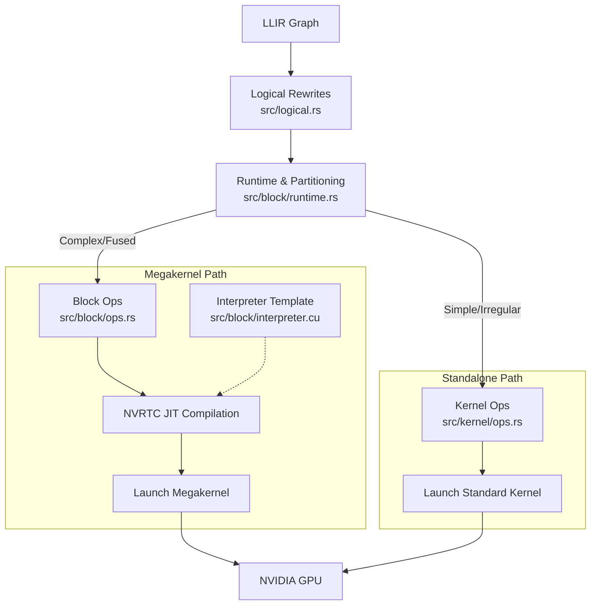

# Luminal CUDA Backend Developer Guide

This document provides a comprehensive overview of the `luminal_cuda` crate, which serves as the NVIDIA GPU backend for the Luminal compiler.

## Architecture Overview

The backend transforms high-level computation graphs into optimized CUDA kernels. It employs a hybrid execution model:
1.  **Standalone Kernels:** For simple, element-wise operations (like `Gather` or simple `Add`).
2.  **Megakernels (Block Interpreter):** For complex, fused subgraphs. A single "interpreter" kernel is launched that consumes a queue of tasks, minimizing CPU-GPU synchronization overhead.



## Module Guide

### 1. Logical Optimization
*   **File:** [`src/logical.rs`](#cuda-logical-operations-logicalrs)
*   **Role:** Defines high-level graph rewrites (e.g., fusing `Mul`+`Sigmoid`+`Mul` into `Swish`) using `egglog`.

### 2. The Runtime Orchestrator
*   **File:** [`src/block/runtime.rs`](#cuda-block-runtime-documentation)
*   **Role:** Manages memory, partitions the graph into "convex" subgraphs, and schedules execution. It decides which nodes become standalone kernels and which get fused into a Megakernel.

### 3. The Megakernel (Block Interpreter)
This is the core innovation of the backend, allowing dynamic execution of fused graphs.
*   **Definitions:** [`src/block/ops.rs`](#module-luminal_cudablockops) defines the Rust structs for fused operations (e.g., `RowRope`, `TileMatmul`).
*   **CUDA Kernel:** [`src/block/interpreter.cu`](#cuda-block-interpreter-documentation) is the C++ template file that acts as the persistent worker loop on the GPU.

### 4. Standalone Kernels
*   **File:** [`src/kernel/ops.rs`](#module-luminal_cudakernelops)
*   **Role:** Handles operations that don't fit the Megakernel model (e.g., `Gather` or simple broadcasting additions), compiling them as individual CUDA kernels.

---

# luminal/crates/luminal_cuda/src/block/interpreter.cu

Here is the developer documentation for `luminal/crates/luminal_cuda/src/block/interpreter.cu`.

---


## CUDA Block Interpreter Documentation

**File:** `luminal/crates/luminal_cuda/src/block/interpreter.cu`


### Overview

The `interpreter.cu` file defines a **Persistent CUDA Kernel** designed to execute a dynamic graph of operations entirely on the GPU. Instead of launching a separate kernel for every operation (which incurs CPU-GPU synchronization and launch overhead), Luminal launches this single "worker" kernel.

This kernel acts as an interpreter: it loops indefinitely, fetching `Task` structs from a global queue, managing data dependencies via custom semaphores, and executing specific operation logic injected at runtime.


### Template System

This file serves as a **C++ Template**. It is not compilable as-is. The Rust compiler backend (specifically `luminal_cuda`) reads this file and performs string replacement on specific placeholders before compiling the final CUDA source (likely using NVRTC).


#### Placeholders
| Placeholder | Description |
| :--- | :--- |
| `%extra_op_codes%` | Injected `enum` variants for the specific operations required by the graph (e.g., `Add`, `MatMul`). |
| `%extra_op_structs%` | Helper structs required by specific operations. |
| `%extra_op_payloads%` | Fields added to the `Payload` union to hold operation-specific constants or configuration. |
| `%constants%` | Global constants required by the kernel. |
| `%expr_fns%` | Case statements inside `eval_expression` to handle dynamic shape/stride calculations. |
| `%extra_op_functions%` | Helper device functions required by specific operations. |
| `%extra_op_calls%` | The `switch` statement cases inside the worker loop that execute the actual logic based on `t->op`. |


### Data Structures


#### `Task`
The fundamental unit of work.
```cpp
struct Task {
  OpCode op;           // The operation to perform
  int range;           // Total number of iterations/elements for this task
  int remaining;       // Counter for remaining work (decremented by workers)
  
  // Dependency Management (Strides and Bases)
  // Used to calculate indices in the 'ready' barrier array
  int in_dep_a_stride; int in_dep_a_base;
  int in_dep_b_stride; int in_dep_b_base;
  int in_dep_c_stride; int in_dep_c_base;
  int out_dep_stride;  int out_dep_base;
  
  const float* source_ptrs[3]; // Input data pointers
  float* out_ptr;              // Output data pointer
  Payload payload;             // Op-specific data
};
```


#### `SMEvent`
Used for fine-grained profiling within the Streaming Multiprocessor (SM).
```cpp
struct SMEvent {
  unsigned long long start; // Global timer timestamp
  int event;                // Event ID (0=Issue, 1=Wait, >2=Op Start)
};
```


### Synchronization Mechanisms

Since multiple CUDA blocks (workers) access the same task queue and data buffers simultaneously, custom synchronization is implemented.


#### 1. Task Queue Locking
A spinlock mutex protects the global task queue index (`head`).
*   **`mutex_lock(int *m)`**: Uses `atomicCAS` to acquire the lock.
*   **`mutex_unlock(int *m)`**: Uses `atomicExch` to release.
*   **`fetch_next_task`**: Locks the queue, reads the `head` index, manages the `remaining` counter for the current task, and advances `head` only when a task is fully consumed.


#### 2. Dependency Barriers (`ready` array)
To ensure operations don't read data before it is written, a global `ready` array acts as a semaphore system.
*   **Logic**:
    *   **Value > 0**: The resource is currently being written to (Busy).
    *   **Value == 0**: The resource is ready to be read.
*   **Implementation**:
    *   Before execution: `atomicAdd(&ready[dep_out], 1)` marks the output as busy.
    *   Wait phase: `while (atomicAdd(&ready[dep_in], 0) > 0) __nanosleep(64);` busy-waits until inputs are 0.
    *   After execution: `atomicSub(&ready[dep_out], 1)` releases the output.


### Kernel Logic: `worker_kernel`

The entry point `worker_kernel` executes the following lifecycle:

1.  **Initialization**: Sets up timing pointers.
2.  **Infinite Loop**:
    *   **Fetch**: Thread 0 of the block calls `fetch_next_task`. If no tasks remain, the block exits.
    *   **Sync**: `__syncthreads()` ensures all threads in the block know the current task.
    *   **Dependency Resolution (Thread 0)**:
        *   Calculates dependency indices using `eval_expression`.
        *   Marks output as "in-flight".
        *   Waits for inputs A, B, and C to become ready.
    *   **Execute**:
        *   A `switch(t->op)` block executes the injected operation logic (via `%extra_op_calls%`).
    *   **Finalize**:
        *   Thread 0 marks the output as ready (decrements barrier).


### Helper Functions

*   **`eval_expression(int expression, int const_z)`**: Evaluates symbolic shapes or strides. The `expression` integer acts as an ID mapping to a specific formula injected into the `%expr_fns%` placeholder.
*   **`read_globaltimer()`**: Reads the GPU's global 64-bit timer for profiling.

# luminal/crates/luminal_cuda/src/block/ops.rs

Here is the developer documentation for `luminal/crates/luminal_cuda/src/block/ops.rs`.

---


## Module: `luminal_cuda::block::ops`

This module defines the **Block Operations** (BlockOps) for the Luminal CUDA backend. It serves as the bridge between the high-level graph representation (Egglog) and the low-level CUDA C++ kernel execution.

Each struct in this file represents a specific, fused GPU kernel. These structures implement two critical traits:
1.  **`EgglogOp`**: Defines how to identify, rewrite, and extract this operation from the high-level compute graph.
2.  **`BlockOp`**: Defines the actual CUDA C++ code generation and runtime argument scheduling.


### Core Architecture

The pipeline for these operations functions as follows:
1.  **Pattern Matching (`rewrites`)**: The compiler scans the graph for specific mathematical patterns (e.g., `x * sigmoid(x) * y` for SwishMul).
2.  **Extraction (`extract`)**: When a pattern is found, it is replaced by a concrete struct from this module (e.g., `RowSwishMul`).
3.  **Compilation (`cuda_op`)**: During JIT compilation, the `cuda_op` method returns raw C++ strings representing the kernel logic.
4.  **Execution (`schedule_op`)**: At runtime, arguments (pointers, strides, shapes) are packed into a C-compatible struct and sent to the GPU driver.

---


### Supported Operations


#### 1. `RowAdd`
Performs element-wise addition of two tensors, optimized for row-contiguous memory layouts.

*   **Input Pattern**: `Add(a, b)` where strides indicate row-major access.
*   **Kernel Logic**: Simple index-based addition `out[idx] = a[idx] + b[idx]`.
*   **Usage**: General tensor addition.


#### 2. `RowSwishMul`
A fused operation combining the Swish activation function with a multiplication. This is commonly used in Gated Linear Units (GLU), such as in the Llama architecture.

*   **Input Pattern**: Matches a complex graph of `Mul(x, Sigmoid(x), y)`.
*   **Kernel Logic**:
    ```cpp
    float sw = x / (1.0f + __expf(-x)); // Swish calculation
    out[idx] = sw * b[idx];
    ```
*   **Optimization**: Fuses three distinct operations (Sigmoid, Mul, Mul) into a single kernel launch to reduce memory bandwidth usage.


#### 3. `RowRMSNorm`
Performs Root Mean Square Normalization (RMSNorm).

*   **Input Pattern**: Matches the mathematical expansion of RMSNorm: `x * Recip(Sqrt(Mean(x^2) + eps)) * weight`.
*   **Kernel Logic**:
    1.  **Reduction**: Uses shared memory (`__shared__ double`) to compute the sum of squares for the row.
    2.  **Precision**: Accumulates partial sums in `double` to prevent overflow/underflow before converting back to `float`.
    3.  **Normalization**: Broadcasts the inverse RMS value and normalizes the row elements.


#### 4. `RowRope`
Applies Rotary Positional Embeddings (RoPE) to input tensors.

*   **Kernel Logic**:
    *   Calculates `theta` based on position IDs and the RoPE base frequency (500,000.0f).
    *   Uses `__sincosf` for fast trigonometric calculation.
    *   Rotates pairs of elements in the head dimension:
        ```cpp
        head_out[j0] = x0 * c - x1 * s;
        head_out[j1] = x1 * c + x0 * s;
        ```


#### 5. `TileMatmul`
A highly optimized, tiled Matrix Multiplication kernel. This is the workhorse for linear layers.

*   **Input Pattern**: Matches `CubeMul` (3D multiplication) followed by `TileSum`.
*   **Kernel Variants**:
    1.  **Fast Path (Warp Reduction)**:
        *   Triggered when `M=1` (decoding/inference single token), `N` fits in warps, and `K` is a multiple of 128.
        *   Uses `__shfl_down_sync` for warp-level reductions.
        *   Loads tiles of A into shared memory.
    2.  **Generic Path**:
        *   Standard tiled matrix multiplication for larger M/N dimensions (e.g., prefill phase).
        *   Handles arbitrary tile sizes with boundary checks.


#### 6. `GQAAttention`
Implements Grouped Query Attention (GQA), handling the entire attention mechanism (Query * Key -> Softmax -> * Value) in a single fused kernel.

*   **Features**:
    *   **KV Caching**: Automatically handles reading from and writing to the KV cache (stored in `CustomState`).
    *   **Causal Masking**: Implicitly handles causal masking by checking `r < prev`.
    *   **Softmax**: Performs an online softmax calculation (finding max, subtracting, exponentiating, and normalizing) within the kernel using shared memory reductions.
*   **Kernel Logic**:
    1.  **Update Cache**: If it's the first head in a group, writes current K/V to the cache.
    2.  **Pass 1 (Logits)**: Computes `Q * K^T`, finds the max logit for numerical stability.
    3.  **Pass 2 (Aggregation)**: Computes `exp(logit - max)`, accumulates weights, and computes the weighted sum of `V`.

---


### Implementation Details


#### The `cuda_op` Method
Every struct implements `cuda_op`, which returns a tuple `(String, String)`:
1.  **Struct Body**: A C struct definition defining the parameters the kernel expects (strides, pointers, dimensions).
2.  **Function Body**: The actual C++ CUDA code.
    *   *Note*: The code uses a helper `eval_expression(payload.variable, current)` to resolve symbolic shapes at runtime.


#### The `schedule_op` Method
This method is responsible for serializing the runtime arguments into a byte buffer compatible with the C struct defined in `cuda_op`.
*   It uses `CStructBuilder` to pack integers and pointers.
*   **Special Case**: `GQAAttention` retrieves the `KV_cache` pointer from `CustomState` passed in the arguments, allowing the kernel to persist state across runs.


#### Memory Layouts
*   **Strides**: Most operations rely on `flatten_strides` to calculate memory offsets based on the symbolic shapes of the graph.
*   **Barriers**: `consumer_barriers_seperate` defines synchronization requirements between this op and its consumers, ensuring memory safety in the async CUDA stream.

# luminal/crates/luminal_cuda/src/block/runtime.rs

Here is the developer documentation for `luminal/crates/luminal_cuda/src/block/runtime.rs`.

---


## CUDA Block Runtime Documentation


### Overview
The `runtime.rs` file in `luminal_cuda` implements the execution engine for running Luminal computation graphs on NVIDIA GPUs. It is responsible for memory management, kernel compilation, graph partitioning, and the execution of the "Megakernel" architecture—a system that fuses multiple operations into a single kernel launch to minimize CPU-GPU synchronization overhead.


### Core Structures


#### `CudaRuntime`
The primary entry point for the backend. It implements the `luminal::graph::Runtime` trait.

```rust
pub struct CudaRuntime {
    pub buffers: FxHashMap<NodeIndex, CudaSlice<u8>>, // GPU memory storage
    pub llir_graph: luminal::graph::LLIRGraph,        // The Low-Level IR graph
    cuda_stream: Arc<CudaStream>,                     // The CUDA stream for async execution
    cuda_context: Arc<CudaContext>,                   // The CUDA driver context
    exec_graph: StableGraph<ExecutableKernel, (), Directed>, // The compiled execution graph
    // ...
}
```


#### `ExecutableKernel`
An enum representing a node in the `exec_graph`. It distinguishes between standard kernels and the fused Megakernel.

*   **`Megakernel`**: A fused interpreter kernel that executes a sequence of `BlockOp`s. It contains a `work_queue` of tasks and synchronization barriers.
*   **`Kernel`**: A standard, standalone CUDA kernel launch (used for operations that cannot be fused into the block interpreter).


#### `Task` and `Payload`
These `repr(C)` structs define the binary interface between the Rust runtime and the CUDA interpreter kernel.

*   **`Task`**: Represents a single operation instruction for the GPU interpreter. It contains dependency strides, memory pointers, and the operation payload.
*   **`Payload`**: A union containing operation-specific parameters (e.g., `AttentionOp`).


### The Compilation Pipeline

The `compile` method transforms the `LLIRGraph` into an `exec_graph`. The process follows these steps:

1.  **Identification**: It identifies nodes implementing `BlockOp` (operations suitable for the block interpreter).
2.  **Partitioning**: It calls `partition_marked_convex` to group `BlockOp` nodes into valid subgraphs. A valid subgraph is "convex," meaning no path exists between two nodes in the subgraph that passes through a node *outside* the subgraph.
3.  **Megakernel Generation**: For each partition:
    *   **Barrier Calculation**: `get_barrier_strides` calculates synchronization requirements between producers and consumers within the block.
    *   **Interpreter Compilation**: `compile_interpreter` generates a custom CUDA kernel (PTX) via NVRTC. It injects C++ code snippets for the specific operations contained in the block.
    *   **Task Queue Construction**: A linear list of `Task` structs is created, representing the topological sort of the subgraph.
4.  **Standard Kernel Handling**: Nodes implementing `KernelOp` (that aren't `BlockOp`) are compiled individually.
5.  **Graph Construction**: The `exec_graph` is built, linking Megakernels and standard Kernels based on data dependencies.


### The Megakernel Architecture

The Megakernel is a dynamic interpreter running on the GPU. Instead of launching 50 separate kernels for 50 operations, the runtime launches one interpreter kernel.


#### Dynamic Code Generation (`compile_interpreter`)
The runtime reads `interpreter.cu` as a template and performs string replacement to inject:
1.  **Op Codes**: Enums for the specific operations in the graph.
2.  **Structs**: C-struct definitions for operation payloads.
3.  **Functions**: The actual CUDA device code for the operations.
4.  **Switch Cases**: Logic to dispatch execution based on the Op Code.

This generated C++ code is compiled at runtime using `cudarc::nvrtc`.


#### Execution (`run_megakernel`)
When executing a Megakernel:
1.  **Upload**: The `Task` queue and barrier arrays are uploaded to the GPU.
2.  **Launch**: The interpreter kernel is launched.
    *   **Grid**: 114 blocks (matching the number of SMs on high-end GPUs like H100/A100).
    *   **Block**: 1024 threads.
    *   **Shared Memory**: Allocates ~100KB for dynamic usage.
3.  **Synchronization**: The kernel uses a global barrier system (via the `d_barriers` array) to synchronize tasks that have data dependencies.


### Graph Partitioning Algorithm

The `partition_marked_convex` function is critical for correctness. It ensures that fusing operations does not introduce deadlocks or cycle dependencies.

**Logic:**
1.  **Topological Sort**: Establishes a global order.
2.  **Reachability Analysis**: Uses bitsets to determine which nodes can reach which other nodes.
3.  **Witness Checking**: For a proposed block, it checks "witness" nodes (nodes *not* in the block but reachable from it).
    *   If a node `p` is in the block, and `p` can reach an external node `x`, and `x` can reach another node `q` in the block, then `x` violates convexity.
    *   The algorithm splits components to satisfy this constraint.


### Profiling and Debugging

*   **Perfetto Tracing**: The runtime can record execution timings (`record_exec_timings_to_file`). It captures SM-level events and writes them to a protobuf format compatible with the Perfetto UI.
*   **Debug Buffers**: The `CustomState` enum allows injecting debug buffers to inspect intermediate tensor values during execution.


### Helper Functions

*   **`load_safetensors`**: Utility to load model weights directly into the `buffers` map from disk.
*   **`dtoh_outputs`**: "Device to Host" - retrieves the graph's output tensors from GPU memory.
*   **`allocate_intermediate_buffers`**: Scans the graph to allocate GPU memory for all non-input/non-output tensors before execution.

# luminal/crates/luminal_cuda/src/kernel/ops.rs

Here is the developer documentation for `luminal/crates/luminal_cuda/src/kernel/ops.rs`.

---


## Module: `luminal_cuda::kernel::ops`

This module defines specific CUDA kernel operations used within the Luminal compiler's CUDA backend. It handles the definition, graph rewriting (via Egglog), and Just-In-Time (JIT) compilation of CUDA kernels for basic arithmetic and data movement operations.


### Overview

The module currently implements two primary operations:
1.  **`KernelAdd`**: Element-wise addition with support for broadcasting via strides.
2.  **`KernelGather`**: Gathers elements from a tensor based on an index tensor.

These structures implement two critical traits:
*   **`EgglogOp`**: Allows the operation to be manipulated within the `egglog` equality saturation engine (defining rewrite rules and extraction logic).
*   **`KernelOp`**: Handles the generation of C++ CUDA code, runtime compilation (NVRTC), and kernel launching parameters.


### Type Definitions

```rust
pub type Ops = (KernelAdd, KernelGather);
```
A tuple type alias exporting the operations defined in this module for registration with the compiler.

---


### 1. KernelAdd

Represents an element-wise addition operation on the GPU. It supports broadcasting and arbitrary striding, allowing it to handle complex tensor views without physical data copying prior to the operation.


#### Fields
*   `out_shape`: `Vec<Expression>` - The symbolic shape of the output tensor.
*   `a_stride`: `Vec<Expression>` - Strides for the first input tensor (A).
*   `b_stride`: `Vec<Expression>` - Strides for the second input tensor (B).
*   `out_stride`: `Vec<Expression>` - Strides for the output tensor.


#### Egglog Integration (`EgglogOp`)
*   **Term**: Defined as `KernelAdd`.
*   **Rewrite Rule**:
    ```lisp
    (= ?a (Add ?out_shape ?inp_a ?inp_a_strides ?inp_b ?inp_b_strides ?out_strides))
    =>
    (union ?a (KernelAdd ?out_shape ?inp_a ?inp_a_strides ?inp_b ?inp_b_strides ?out_strides))
    ```
    This rule transforms a generic high-level `Add` node into a backend-specific `KernelAdd` node.


#### CUDA Compilation (`KernelOp`)
The `compile` method performs the following steps:
1.  **Symbol Collection**: Identifies dynamic variables (symbols) within the shapes and strides to handle dynamic shapes at runtime.
2.  **Code Generation**: Constructs a CUDA C++ kernel string.
    *   It uses `flatten_strides(...).to_kernel()` to generate the index calculation logic based on the linear thread ID (`const_z`).
    *   **Kernel Logic**: `C[idx_out] = A[idx_a] + B[idx_b]`.
3.  **JIT Compilation**: Uses `cudarc` and NVRTC to compile the generated string into PTX.
    *   *Note*: Currently targets architecture `sm_90a` (NVIDIA Hopper) and assumes CUDA headers are at `/usr/local/cuda/include`.
4.  **Constant Linking**: Maps dynamic shape variables to global constants in the CUDA module.

---


### 2. KernelGather

Represents a gather operation, where values are selected from a `data` tensor based on indices provided in an `indexes` tensor.


#### Fields
*   `out_shape`: `Vec<Expression>` - The symbolic shape of the output.
*   `index_stride`: `Vec<Expression>` - Strides for the index tensor.
*   `data_stride`: `Vec<Expression>` - Strides for the source data tensor.
*   `out_stride`: `Vec<Expression>` - Strides for the output tensor.


#### Egglog Integration (`EgglogOp`)
*   **Term**: Defined as `KernelGather`.
*   **Rewrite Rule**:
    ```lisp
    (= ?a (Gather ?out_shape ?indexes ?index_strides ?data ?data_strides))
    =>
    (let ?out_strides (RowMajor ?out_shape))
    (union ?a (KernelGather ?out_shape ?indexes ?index_strides ?data ?data_strides ?out_strides))
    ```
    Transforms a high-level `Gather` node. Note that it explicitly calculates `RowMajor` strides for the output during the rewrite.


#### CUDA Compilation (`KernelOp`)
Similar to `KernelAdd`, this generates a custom CUDA kernel:
1.  **Code Generation**:
    ```cpp
    __global__ void gather(float *C, const int *indexes, const float *data) {
        int const_z = blockIdx.x * blockDim.x + threadIdx.x;
        float* out = C + {OUTPUT_OFFSET_LOGIC};
        const_z = indexes[{INDEX_OFFSET_LOGIC}]; // Updates const_z to the value found in indexes
        *out = data[{DATA_OFFSET_LOGIC}];        // Uses updated const_z to sample data
    }
    ```
    *Implementation Detail*: The generated code reuses the variable `const_z`. It first represents the global thread ID to fetch the index, and is then overwritten by the value retrieved from `indexes` to calculate the offset into `data`.

---


### Implementation Details & Constraints


#### Dynamic Shapes
Both kernels utilize `luminal::shape::Expression` to handle symbolic shapes. During compilation, `dyn_vars()` are collected, and corresponding `__constant__` integers are generated in the CUDA code (e.g., `const_a`, `const_b`) to allow the kernel to calculate strides for shapes that are unknown until runtime.


#### Hardcoded Paths and Arch
The `compile_ptx_with_opts` configuration currently contains hardcoded values:
*   **Architecture**: `Some("sm_90a")` - This targets NVIDIA H100 GPUs. This may cause failures on older hardware (e.g., Ampere, Turing) if not adjusted.
*   **Include Paths**: `/usr/local/cuda/include` and `/usr/include`.


#### Threading Model
Both kernels use a 1D grid configuration:
*   **Grid/Block**: The `compile` function returns `(product(out_shape), 1, 1)` as the launch dimension. This implies a linear launch where every thread calculates one output element.
*   **Indexing**: Inside the kernel, `int const_z = blockIdx.x * blockDim.x + threadIdx.x;` is used as the linear index. The `flatten_strides` utility converts this linear index into multi-dimensional offsets.

# luminal/crates/luminal_cuda/src/logical.rs

Here is the developer documentation for `luminal/crates/luminal_cuda/src/logical.rs`.

---


## CUDA Logical Operations (`logical.rs`)

This module defines high-level "logical" operations and graph rewrite rules for the Luminal CUDA backend. It utilizes the `egglog` library to perform graph substitutions, optimizing the computation graph before it is lowered into raw CUDA kernels.

The primary goals of this module are:
1.  **Kernel Fusion:** Combining multiple elementary mathematical operations (e.g., `1 / (1 + exp(-x))`) into single, optimized kernels (e.g., `Sigmoid`).
2.  **Tiling & Blocking:** Transforming tensor shapes and strides to align with GPU hardware requirements (specifically $32\times32$ blocks) for operations like Matrix Multiplication and Reductions.


### Architecture

The module implements the `EgglogOp` trait for several structs. Each struct represents a specific logical operation. The `rewrites()` method defines the pattern matching logic used to identify subgraphs that can be replaced by these optimized operations.


#### Registered Operations
The `Ops` type alias aggregates all operations defined in this module for easy registration with the compiler:
```rust
pub type Ops = (Exp, Sigmoid, CubeMul, TileSum, Softmax);
```

---


### Operation Details


#### 1. CubeMul (Tiled Matrix Multiplication)
**Purpose:** Prepares matrix multiplication operations for block-wise execution (likely targeting Tensor Cores or specific warp-level primitives).

*   **Transformation:** It intercepts standard `Mul` operations.
*   **Logic:**
    1.  Checks if the last three dimensions of the shape are non-zero.
    2.  **Shape Transformation:** Divides the last three dimensions ($M, N, K$) by 32 (using ceiling division).
    3.  **Stride Transformation:** Multiplies the strides of the last three dimensions by 32.
*   **Result:** Converts a standard element-wise multiplication graph node into a `CubeMul` node with tiled dimensions, facilitating hardware-aligned execution.


#### 2. TileSum (Tiled Reduction)
**Purpose:** Optimizes summation reductions by tiling the data, allowing for efficient intra-block reductions on the GPU.

*   **Transformation:** Intercepts `Sum` operations.
*   **Logic:**
    1.  Identifies the last two dimensions ($N, M$).
    2.  **Shape Transformation:** Divides these dimensions by 32.
    3.  **Stride Transformation:** Multiplies the corresponding strides by 32.
*   **Result:** Replaces `Sum` with `TileSum`, signaling the runtime to perform a tiled reduction.


#### 3. Exp (Exponential Fusion)
**Purpose:** Fuses the mathematical expansion of the natural exponential function into a single operation.

*   **Pattern Matched:** $2^{x \cdot \log_2(e)}$
    *   Matches a `Mul` of input $x$ by the constant `1.442695` ($\approx \log_2(e)$).
    *   Matches an `Exp2` (base-2 exponential) of that result.
*   **Result:** Replaces the subgraph with a single `Exp` (base-$e$) operation.


#### 4. Sigmoid (Activation Fusion)
**Purpose:** Fuses the composite operations of the Sigmoid function into a single kernel to reduce memory bandwidth and kernel launch overhead.

*   **Pattern Matched:** $\frac{1}{1 + e^{-x}}$
    1.  `Mul` input by `-1`.
    2.  `Exp` of the result.
    3.  `Add` `1.0` to the result.
    4.  `Recip` (reciprocal) of the result.
*   **Result:** Replaces the entire subgraph with a single `Sigmoid` operation.


#### 5. Softmax (Safe Softmax Fusion)
**Purpose:** Detects and fuses the "Safe Softmax" pattern. This is the most complex rewrite in the module, involving reductions and broadcasting.

*   **Pattern Matched:** $\frac{e^{x - \max(x)}}{\sum e^{x - \max(x)}}$
    1.  **Max:** Calculates row-wise maximum ($x_{max}$).
    2.  **Subtract:** Broadcasts and subtracts $x_{max}$ from $x$.
    3.  **Exp:** Calculates the exponential of the difference.
    4.  **Sum:** Calculates the row-wise sum of the exponentials.
    5.  **Div:** Broadcasts the sum and divides the exponentials by it (implemented as `Recip` followed by `Mul`).
*   **Result:** Replaces the entire subgraph with a single `Softmax` operation.


### Usage in Compiler Pipeline

These operations are typically applied during the high-level optimization phase. The `rewrites` defined here are fed into the `egglog` runner. If the runner finds a match (e.g., the specific sequence of math nodes creating a Sigmoid), it destructively replaces those nodes with the high-level `Sigmoid` node defined in this file.

Later stages of the compiler (in `luminal_cuda`) will look for these specific nodes (`CubeMul`, `TileSum`, `Sigmoid`, etc.) to generate the specific CUDA C++ code required to execute them.