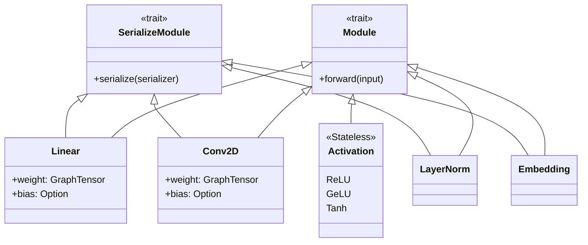

# Luminal NN Developer Guide

The `luminal_nn` crate provides high-level neural network primitives for the Luminal framework. It abstracts raw `GraphTensor` operations into stateful and stateless `Module`s that can be composed to build complex deep learning architectures.

## Architecture Overview

All layers in this crate implement the `Module` trait, allowing them to be chained easily. State (weights/biases) is managed via `GraphTensor`s within the structs.



## Module Index

*   [Activation Functions](#module-luminal_nnactivation) - Stateless wrappers for ReLU, GeLU, Sigmoid, etc.
*   [Convolutional Layers](#convolutional-layers-luminal_nnsrcconvolutionrs) - 1D, 2D, and 3D convolution implementations.
*   [Embeddings](#embedding-module-documentation) - Lookup tables for categorical data/tokens.
*   [Linear Layers](#linear-layer-documentation-luminal_nnlinear) - Fully connected (dense) layers.
*   [Normalization](#module-luminal_nnnorm) - Layer Normalization implementation.
*   [Pooling](#module-documentation-luminal_nnsrcpoolingrs) - Average and Adaptive pooling layers (Draft).

---

# luminal/crates/luminal_nn/src/activation.rs

Here is the developer documentation for `luminal/crates/luminal_nn/src/activation.rs`.

---


## Module: `luminal_nn::activation`

This module defines high-level **Activation Function** modules for the Luminal neural network library. These structs serve as stateless wrappers around `GraphTensor` operations, allowing activation functions to be composed easily within neural network architectures (e.g., inside tuples representing layers).


### Overview

The file implements the `Module` trait for several standard activation functions. Since activation functions are generally element-wise operations with no learnable parameters, these structs are:
1.  **Stateless:** They hold no data.
2.  **Default-derivable:** Easy to instantiate.
3.  **Passthroughs:** The `forward` method delegates directly to the underlying `GraphTensor` high-level operations (e.g., `.relu()`, `.tanh()`).


### Supported Activations

The following structs are exported:

| Struct | Description | Underlying Op |
| :--- | :--- | :--- |
| **`ReLU`** | Rectified Linear Unit ($max(0, x)$) | `input.relu()` |
| **`GeLU`** | Gaussian Error Linear Unit | `input.gelu()` |
| **`Sigmoid`** | Logistic Sigmoid function ($\frac{1}{1+e^{-x}}$) | `input.sigmoid()` |
| **`Swish`** | Swish function ($x \cdot \sigma(x)$) | `input.swish()` |
| **`Tanh`** | Hyperbolic Tangent | `input.tanh()` |


### Implementation Details


#### Trait Implementations

Every activation struct implements the following traits:

1.  **`Default`**: Allows initialization via `ReLU::default()` or simply `ReLU` in contexts where default is inferred.
2.  **`SerializeModule`**:
    *   **Purpose:** Enables the module to be part of a serialized model graph.
    *   **Implementation:** The implementation is empty (`{}`) because these modules have no weights or state to save.
3.  **`Module<GraphTensor>`**:
    *   **Input:** `GraphTensor`
    *   **Output:** `GraphTensor`
    *   **Logic:** Calls the specific unary operation on the input tensor graph node.


#### Code Pattern

All implementations follow this identical pattern:

```rust

##[derive(Default)]
pub struct ActivationName;

impl SerializeModule for ActivationName {
    fn serialize(&self, _: &mut Serializer) {}
}

impl Module<GraphTensor> for ActivationName {
    type Output = GraphTensor;

    fn forward(&self, input: GraphTensor) -> Self::Output {
        input.activation_method()
    }
}
```


### Usage Example

These modules are designed to be used when building models, particularly when chaining layers.

```rust
use luminal::prelude::*;
use luminal_nn::{Linear, ReLU};

fn main() {
    let mut cx = Graph::new();
    
    // Define a simple feed-forward network: Linear -> ReLU -> Linear
    let model = (
        Linear::new(10, 32, false, &mut cx),
        ReLU, // Activation module used here
        Linear::new(32, 5, false, &mut cx),
    );

    let input = cx.tensor((1, 10));
    let output = model.forward(input);
}
```


### Testing Strategy

The module includes a test suite (`mod tests`) that verifies the correctness of the activation functions, specifically focusing on `ReLU` in combination with `Linear` layers.


#### Verification Methods
1.  **Graph Compilation Consistency:**
    *   The test runs the model in **unoptimized** mode.
    *   The test compiles the model using `GenericCompiler` and runs it in **optimized** mode.
    *   It asserts that the results are numerically close (`assert_close`).

2.  **Cross-Library Verification (dfdx):**
    *   The test constructs an identical model architecture using the `dfdx` library (a deep learning crate for Rust).
    *   It manually sets the weights of the `dfdx` model to match the `luminal` model.
    *   It asserts that the outputs of the `luminal` implementation match the outputs of the `dfdx` implementation.


#### Test Coverage
*   **Single Input:** Verifies behavior on a 1D tensor.
*   **Batched Input:** Verifies behavior on a 2D tensor (batch size > 1) to ensure broadcasting and dimension handling are correct.

# luminal/crates/luminal_nn/src/convolution.rs

Here is the developer documentation for the `luminal_nn` convolution module.


## Convolutional Layers (`luminal_nn/src/convolution.rs`)

This module implements 1D, 2D, and 3D convolutional layers for the Luminal framework. These layers are designed to be composable within the `Graph` and lower the convolution operation into a sequence of reshaping, pooling (for patch extraction), and matrix multiplications.


### 1. Conv1D

The `Conv1D` struct implements a one-dimensional convolution, typically used for temporal sequences or audio data.


#### Structure
```rust
pub struct Conv1D {
    pub weight: GraphTensor, // Shape: (ch_out, ch_in * kernel)
    pub bias: Option<GraphTensor>,
    padding: usize,
    dilation: usize,
    stride: usize,
    kernel: usize,
    ch_in: usize,
}
```


#### Initialization
**`Conv1D::new`**
Initializes the weights and optional bias in the computation graph.
*   **Arguments:** `ch_in`, `ch_out`, `kernel`, `stride`, `dilation`, `padding`, `bias` (bool), `cx` (Graph context).
*   **Weight Initialization:** Weights are initialized with the shape `(ch_out, ch_in * kernel)`. This pre-flattened shape facilitates the matrix multiplication in the forward pass.


#### Forward Pass Logic
The `forward` method transforms the input into a format suitable for matrix multiplication (often called `im2col` in other frameworks, though implemented here via pooling and reshaping).

1.  **Input Handling:** Expects input of shape `(batch..., ch_in, seq_len)`. It normalizes the batch dimensions to handle arbitrary batch sizes.
2.  **Padding:** Explicitly applies padding to the temporal dimension using `.pad()`.
3.  **Patch Extraction:** Uses `.pool_last_dim(kernel, stride, dilation)` to extract sliding windows from the sequence.
4.  **Reshape & Permute:** Dimensions are permuted to align the extracted patches with the flattened weight matrix.
5.  **Computation:** Performs a `matmul` between the reshaped input and the transposed weights.
6.  **Bias:** Adds the bias vector if present.

---


### 2. Conv2D

The `Conv2D` struct implements a two-dimensional convolution, standard for image processing.


#### Structure
```rust
pub struct Conv2D {
    pub weight: GraphTensor,       // Shape: (ch_out, ch_in * kernel_x * kernel_y)
    pub bias: Option<GraphTensor>, // Shape: (ch_out)
    kernel: (usize, usize),
    stride: (usize, usize),
    dilation: (usize, usize),
    ch_out: usize,
    ch_in: usize,
}
```


#### Initialization
**`Conv2D::new`**
*   **Arguments:** `ch_in`, `ch_out`, `kernel` (h, w), `stride` (h, w), `dilation` (h, w), `bias` (bool), `cx`.
*   **Note:** Unlike `Conv1D`, this implementation of `Conv2D` does not currently accept a `padding` argument in the constructor.


#### Forward Pass Logic
The 2D forward pass lowers the convolution to matrix multiplication by extracting patches along both spatial dimensions.

1.  **Input Expansion:** If the input is 3D (CH, H, W), it expands a batch dimension to make it 4D.
2.  **Dimension Calculation:** Calculates output dimensions based on input size, kernel, stride, and dilation.
3.  **Patch Extraction (Pooling):**
    *   Applies `pool_last_dim` on the Y-dimension.
    *   Permutes dimensions.
    *   Applies `pool_last_dim` on the X-dimension.
    *   *Result:* This effectively linearizes the local 2D patches.
4.  **Matmul:** Reshapes the pooled input to `(batch, channels * kx * ky, output_pixels)` and performs matrix multiplication with the weights.
5.  **Reconstruction:** Reshapes the result back to `(batch, ch_out, h_out, w_out)`.

---


### 3. Conv3D

The `Conv3D` struct implements a three-dimensional convolution, used for volumetric data (e.g., MRI scans, video).


#### Structure
```rust
pub struct Conv3D {
    pub weight: GraphTensor, // Shape: (ch_out, ch_in * k_x * k_y * k_z)
    pub bias: Option<GraphTensor>,
    kernel: (usize, usize, usize),
    stride: (usize, usize, usize),
    dilation: (usize, usize, usize),
    ch_in: usize,
    ch_out: usize,
}
```


#### Forward Pass Logic
The logic extends the `Conv2D` approach to a third dimension.

1.  **Dimension Calculation:** Computes output sizes for X, Y, and Z dimensions.
2.  **Patch Extraction:**
    *   Pools and permutes the Y dimension.
    *   Pools and permutes the X dimension.
    *   Pools and permutes the Z dimension.
3.  **Flattening:** The input is reshaped to `(ch_in * kx * ky * kz, total_output_voxels)`.
4.  **Computation:** Performs `matmul` with weights and reshapes to the final 5D tensor `(batch, ch_out, x, y, z)`.

---


### Serialization

All three structs (`Conv1D`, `Conv2D`, `Conv3D`) implement the `SerializeModule` trait.
*   **Keys:**
    *   `"weight"`: The weight tensor.
    *   `"bias"`: The bias tensor (only saved if `bias` is `Some`).


### Implementation Notes

*   **Graph Operations:** These layers rely heavily on `pool_last_dim`. In Luminal, this operation is used to create sliding window views of the data without necessarily copying memory immediately, allowing the compiler to optimize the fusion of the subsequent `matmul`.
*   **Symbolic Shapes:** The code uses `.simplify()` on dimension calculations, suggesting support for symbolic graph shapes (dynamic input sizes).
*   **Batching:** `Conv1D` and `Conv2D` contain specific logic to handle inputs with or without explicit batch dimensions by expanding and squeezing dimensions as necessary.

# luminal/crates/luminal_nn/src/embedding.rs

Here is the developer documentation for the `Embedding` module found in `luminal/crates/luminal_nn/src/embedding.rs`.

**Note:** The source code provided is currently commented out in the file. The documentation below describes the logic and structure as defined in the commented block, assuming it is intended to be active code.

---


## Embedding Module Documentation

The `Embedding` module implements a simple lookup table that stores embeddings of a fixed dictionary and size. This module is typically used to store word embeddings and retrieve them using indices. The input to the module is a list of indices, and the output is the corresponding word embeddings.


### Struct Definition

```rust
pub struct Embedding {
    permute: bool,
    pub weight: GraphTensor, // Shape: (n_embeddings, embedding_dim)
    embedding_dim: usize,
}
```


#### Fields
*   **`weight`**: The learnable weights of the module of shape `(num_embeddings, embedding_dim)`.
*   **`embedding_dim`**: The size of each embedding vector.
*   **`permute`**: A boolean flag indicating the memory layout of the weight tensor. If `true`, the weights are stored transposed `(embedding_dim, num_embeddings)` internally but treated logically as `(num_embeddings, embedding_dim)`.


### Constructors


#### `new`
```rust
pub fn new(n_embeddings: usize, embedding_dim: usize, cx: &mut Graph) -> Self
```
Initializes a standard embedding layer.
*   **Arguments**:
    *   `n_embeddings`: Size of the dictionary of embeddings.
    *   `embedding_dim`: The size of each embedding vector.
    *   `cx`: Mutable reference to the computation `Graph`.
*   **Behavior**: Creates a named tensor "Embedding Weight" with shape `(n_embeddings, embedding_dim)`.


#### `new_permuted`
```rust
pub fn new_permuted(n_embeddings: usize, embedding_dim: usize, cx: &mut Graph) -> Self
```
Initializes an embedding layer with transposed storage.
*   **Behavior**: Creates a named tensor "Embedding Weight" with shape `(embedding_dim, n_embeddings)`.
*   **Use Case**: This is often used for optimization purposes depending on the specific backend or hardware memory access patterns.


#### `initialize`
```rust
pub fn initialize(self) -> Self
```
Initializes the weights with random values.
*   **Implementation**: Uses `luminal::tests::random_vec` to populate the weight tensor.


### Core Logic


#### Forward Pass (`Module` Trait)
```rust
fn forward(&self, input: GraphTensor) -> Self::Output
```
Retrieves the embeddings for the given indices.

1.  **Flattening**: The input tensor (indices) is flattened into a 1D vector to facilitate the gather operation.
2.  **Gathering**:
    *   If `permute` is `false`: Performs a standard gather on `self.weight`.
    *   If `permute` is `true`: Permutes `self.weight` to `(1, 0)` before gathering to align dimensions.
3.  **Reshaping**: The output is reshaped to match the input dimensions plus the embedding dimension.
    *   Input Shape: `(Batch, Sequence)`
    *   Output Shape: `(Batch, Sequence, Embedding_Dim)`


#### Reverse Operation
```rust
pub fn reverse(&self, input: GraphTensor) -> GraphTensor
```
Performs the reverse operation, often used in language modeling heads to project from the embedding dimension back to the vocabulary size (logits).

*   **Operation**: Matrix multiplication (`matmul`).
*   **Logic**:
    *   If `permute` is `true`: `input.matmul(self.weight)` (Direct matmul because weight is already `(Embed, Vocab)`).
    *   If `permute` is `false`: `input.matmul(self.weight.permute((1, 0)))` (Transposes weight to align dimensions).


### Serialization

The module implements `SerializeModule`.
```rust
impl SerializeModule for Embedding {
    fn serialize(&self, s: &mut luminal::module::Serializer) {
        s.tensor("weight", self.weight);
    }
}
```
Only the `weight` tensor is serialized. The `permute` flag and `embedding_dim` are structural configurations assumed to be known at reconstruction time.


### Testing

The module includes a test suite (`mod tests`) that verifies correctness against the `dfdx` library (another Rust deep learning crate).

*   **Test**: `test_embedding`
*   **Procedure**:
    1.  Creates a Luminal graph and an `Embedding` module.
    2.  Sets specific weights and input indices.
    3.  Compiles and executes the graph.
    4.  Builds an equivalent `dfdx` model on the CPU with identical weights.
    5.  Asserts that the outputs of the Luminal model match the `dfdx` model outputs.

# luminal/crates/luminal_nn/src/linear.rs

Here is the developer documentation for the `Linear` module within the `luminal_nn` crate.

---


## Linear Layer Documentation (`luminal_nn::linear`)

The `Linear` struct represents a fully connected (dense) neural network layer. It performs a linear transformation on the incoming data: $y = xA^T + b$.


### Overview

*   **Struct:** `Linear`
*   **Implements:** `Module<GraphTensor>`, `SerializeModule`
*   **Location:** `luminal/crates/luminal_nn/src/linear.rs`

This layer manages a weight matrix and an optional bias vector. It supports standard weight layouts `(Input, Output)` as well as permuted layouts `(Output, Input)` to accommodate different initialization styles or optimization requirements.


### Usage Example

```rust
use luminal::prelude::*;
use luminal_nn::Linear;

fn main() {
    let mut cx = Graph::new();
    
    // Create a linear layer: Input features=3, Output features=4, with Bias=true
    let model = Linear::new(3, 4, true, &mut cx).init_rand();
    
    // Create an input tensor (Batch Size=2, Input Features=3)
    let input = cx.tensor((2, 3)).set([1.0, 2.0, 3.0, 1.0, 2.0, 3.0]);
    
    // Perform forward pass
    let output = model.forward(input);
    
    // Retrieve results
    let mut result = output.retrieve();
    cx.execute();
    
    println!("{:?}", result.data());
}
```


### API Reference


#### Constructors


##### `new`
```rust
pub fn new(inp: usize, out: usize, bias: bool, cx: &mut Graph) -> Self
```
Creates a new Linear layer with weights shaped `(inp, out)`.
*   **inp**: Size of the input dimension.
*   **out**: Size of the output dimension.
*   **bias**: If `true`, initializes a bias tensor of size `out`.
*   **cx**: Mutable reference to the computation `Graph`.


##### `new_permuted`
```rust
pub fn new_permuted(inp: usize, out: usize, bias: bool, cx: &mut Graph) -> Self
```
Creates a new Linear layer with weights shaped `(out, inp)`.
*   **Note**: During the `forward` pass, the weights are permuted `(1, 0)` to align with the matrix multiplication requirements. This is often useful when loading weights from frameworks that store linear weights as `[out_features, in_features]`.


#### Initialization


##### `init_rand`
```rust
pub fn init_rand(self) -> Self
```
Initializes the `weight` (and `bias` if present) tensors with random values drawn from a uniform distribution between `-1.0` and `1.0`.
*   **Returns**: The modified `Self` instance (builder pattern).


#### Forward Pass


##### `forward`
```rust
fn forward(&self, input: GraphTensor) -> GraphTensor
```
Performs the matrix multiplication and bias addition.
1.  **MatMul**: Computes `input * weight`. If the layer was created with `new_permuted`, the weight tensor is transposed before multiplication.
2.  **Bias**: If a bias exists, it is broadcasted (`expand`) to match the output shape and added to the result.


### Internal Structure

```rust
pub struct Linear {
    pub weight: GraphTensor,
    pub bias: Option<GraphTensor>,
    permute: bool,
}
```

*   **weight**: The learnable weight matrix. Named "Weight" in the graph.
*   **bias**: The optional learnable bias vector. Named "Bias" in the graph.
*   **permute**: A boolean flag set during construction.
    *   `false` (via `new`): Weights are used as-is.
    *   `true` (via `new_permuted`): Weights are transposed during `forward`.


### Serialization

The struct implements `SerializeModule`.
*   **Weight Key**: `"weight"`
*   **Bias Key**: `"bias"` (only serialized if `bias` is `Some`).


### Testing

The module includes a test suite `test_linear` which verifies:
1.  Correctness of the forward pass against raw data.
2.  Consistency between unoptimized execution and compiled execution (using `GenericCompiler`).

# luminal/crates/luminal_nn/src/norm.rs

Here is the developer documentation for the `luminal_nn::norm` module, based on the provided code.

---


## Module: `luminal_nn::norm`

This module implements **Layer Normalization**, a technique used to normalize the distributions of intermediate layers. It enables smoother gradients, faster training, and better generalization accuracy.


### Struct: `LayerNorm`

The `LayerNorm` struct represents a normalization layer that can optionally apply an affine transformation (learnable weight and bias) to the normalized data.

```rust

##[derive(Default)]
pub struct LayerNorm {
    pub weight: Option<GraphTensor>,
    pub bias: Option<GraphTensor>,
    mean_norm: bool,
    epsilon: f32,
}
```


#### Fields

| Field | Type | Description |
| :--- | :--- | :--- |
| `weight` | `Option<GraphTensor>` | The learnable scale parameter ($\gamma$). If `None`, no scaling is applied. |
| `bias` | `Option<GraphTensor>` | The learnable shift parameter ($\beta$). If `None`, no shifting is applied. |
| `mean_norm` | `bool` | If `true`, the input is centered (mean subtracted) before standardization. |
| `epsilon` | `f32` | A small constant added to the variance to avoid division by zero during standardization. |

---


### Methods


#### `new`

Constructs a new `LayerNorm` instance and registers its parameters in the computation graph.

```rust
pub fn new(
    dim: usize,
    weight: Option<&str>,
    bias: Option<&str>,
    mean_norm: bool,
    epsilon: f32,
    cx: &mut Graph,
) -> Self
```

**Parameters:**
*   `dim`: The size of the dimension to be normalized (usually the embedding dimension or feature size).
*   `weight`: Optional name for the weight tensor. If provided, a learnable weight tensor is created in the graph `cx`.
*   `bias`: Optional name for the bias tensor. If provided, a learnable bias tensor is created in the graph `cx`.
*   `mean_norm`: Whether to subtract the mean from the input.
*   `epsilon`: Numerical stability constant (e.g., `1e-5`).
*   `cx`: Mutable reference to the `Graph` to allocate tensors.


#### `initialize`

Initializes the weight and bias tensors (if they exist) with random values.

```rust
pub fn initialize(self) -> Self
```

*   **Behavior:** Uses a uniform distribution between -1 and 1 via `random_vec_rng`.
*   **Returns:** The modified `Self` instance (builder pattern).

---


### Trait Implementations


#### `Module<GraphTensor>`

Implements the forward pass logic for the layer.

```rust
fn forward(&self, mut input: GraphTensor) -> Self::Output
```

**Logic Flow:**
1.  **Mean Centering (Optional):** If `mean_norm` is true, the mean of the last axis is subtracted from the input.
2.  **Standardization:** The input is divided by $\sqrt{\sigma^2 + \epsilon}$ along the last axis.
3.  **Affine Transform (Optional):**
    *   If `weight` is present, multiply the result by the weight (broadcasted).
    *   If `bias` is present, add the bias to the result (broadcasted).


#### `SerializeModule`

Handles the serialization of the layer's learnable parameters.

```rust
fn serialize(&self, s: &mut Serializer)
```

*   Saves `weight` under the key `"weight"`.
*   Saves `bias` under the key `"bias"`.

---


### Usage Example

```rust
use luminal::prelude::*;
use luminal_nn::norm::LayerNorm;

fn main() {
    let mut cx = Graph::new();
    
    // 1. Define input dimensions
    let input = cx.tensor::<R2<32, 512>>(); // Batch size 32, Hidden dim 512
    
    // 2. Create LayerNorm
    // - Dimension: 512
    // - Weight name: "ln_w"
    // - Bias name: "ln_b"
    // - Mean centering: true
    // - Epsilon: 1e-5
    let ln = LayerNorm::new(512, Some("ln_w"), Some("ln_b"), true, 1e-5, &mut cx)
        .initialize(); // Randomly init weights
        
    // 3. Forward pass
    let output = ln.forward(input);
    
    // 4. (Optional) Execute graph...
}
```


### Mathematical Formulation

Given an input vector $x$, the operation performed is:

$$
\hat{x} = \frac{x - \mu}{\sqrt{\sigma^2 + \epsilon}}
$$

$$
y = \hat{x} \cdot \gamma + \beta
$$

Where:
*   $\mu$ is the mean of $x$ (calculated if `mean_norm` is true).
*   $\sigma^2$ is the variance of $x$.
*   $\gamma$ is `weight`.
*   $\beta$ is `bias`.

# luminal/crates/luminal_nn/src/pooling.rs


## Module Documentation: `luminal_nn/src/pooling.rs`

**Status:** ⚠️ **Draft / Commented Out**
The code in this file is currently commented out in the source tree. It represents a draft implementation of 2D Average Pooling layers using high-level `GraphTensor` operations.


### Overview

This module is intended to provide pooling layer implementations for the `luminal_nn` crate. It focuses on down-sampling operations commonly used in Convolutional Neural Networks (CNNs).

The implementations rely on decomposing pooling into primitive tensor operations (sliding window extraction, reshaping, and reduction) rather than opaque kernels.


### Components


#### 1. `AvgPool2D`

Standard 2D Average Pooling. This layer applies a fixed-size window over the input and calculates the average value within that window.


##### Configuration
*   **`kernel`**: `(usize, usize)` - The height and width of the pooling window.
*   **`stride`**: `(usize, usize)` - The step size for the window traversal.


##### Forward Pass Logic
The `forward` method transforms an input `GraphTensor` into a down-sampled output.

1.  **Input Normalization**: Checks if the input is Rank-3 `(C, H, W)`. If so, it expands it to Rank-4 `(1, C, H, W)` to handle batching uniformly.
2.  **Dimension Calculation**: Computes output spatial dimensions using standard arithmetic:
    $$ Dim_{out} = \frac{Dim_{in} - Kernel}{Stride} + 1 $$
3.  **Window Extraction**:
    *   Uses `pool_last_dim` (likely a sliding window/im2col primitive) on the width dimension.
    *   Permutes axes.
    *   Uses `pool_last_dim` on the height dimension.
4.  **Reduction**:
    *   Reshapes the tensor to group the kernel elements together.
    *   Applies `.mean(2)` to average over the kernel window.
5.  **Output**: Reshapes to `(Batch, Channel, H_out, W_out)`.


#### 2. `AdaptiveAvgPool2D`

Adaptive Average Pooling. Unlike standard pooling where kernel and stride are fixed, this layer accepts a target **output size**. It dynamically calculates the necessary kernel size and stride based on the input tensor's dimensions during the forward pass.


##### Configuration
*   **`output_size`**: `(usize, usize)` - The target height and width of the output tensor.


##### Forward Pass Logic
1.  **Input Normalization**: Handles optional batch dimension similar to `AvgPool2D`.
2.  **Dynamic Parameter Calculation**:
    *   Retrieves input dimensions $(H_{in}, W_{in})$.
    *   Calculates stride: $S = \lfloor H_{in} / H_{out} \rfloor$
    *   Calculates kernel: $K = H_{in} - (H_{out} - 1) \times S$
3.  **Execution**: Performs the same window extraction and mean reduction strategy as `AvgPool2D` using the calculated $K$ and $S$.


### Implementation Details


#### Serialization
Both structs implement `SerializeModule`.
*   **Parameters**: Neither struct contains learnable weights (no `GraphTensor` fields).
*   **Implementation**: The `serialize` methods are empty, as only configuration data (kernel/stride/output_size) defines the layer, and no state needs to be saved to the model file.


#### Tensor Manipulation Strategy
The implementation demonstrates a "pure" graph approach to pooling. Instead of calling a specific CUDA kernel for `AvgPool`, it constructs the operation via:

```rust
input
    .pool_last_dim(...)       // 1. Extract windows (Width)
    .permute(...)             // 2. Rotate to expose Height
    .pool_last_dim(...)       // 3. Extract windows (Height)
    .permute(...)             // 4. Re-align
    .reshape(...)             // 5. Flatten window elements
    .mean(2)                  // 6. Reduce via Average
```

This approach allows the underlying compiler (Luminal) to potentially fuse these operations or optimize the graph without needing specific backend support for every variation of pooling.