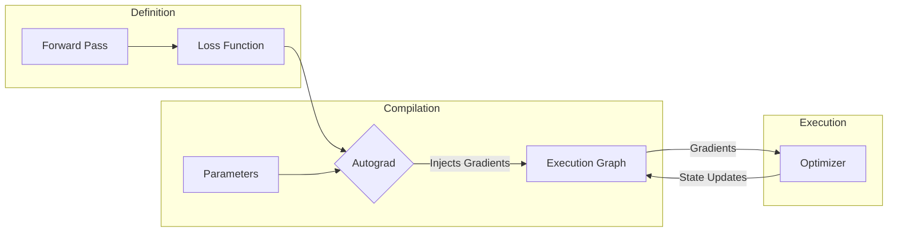

# Luminal Training Developer Guide

The `luminal_training` crate provides the essential building blocks for training neural networks using the Luminal graph compiler. It bridges the gap between static graph construction and dynamic training loops.

## Architecture Overview

The training process involves three main stages handled by this library:
1.  **Loss Calculation:** Defining the objective.
2.  **Automatic Differentiation:** Generating gradients via the `Autograd` compiler pass.
3.  **Optimization:** Applying gradients to parameters using `Optimizer` structs.



## Module Guides

*   [**Autograd**](#autograd-module-documentation): Details the reverse-mode automatic differentiation engine.
*   [**Loss Functions**](#module-luminal_trainingloss): Documentation for regression and classification loss functions.
*   [**Optimizers**](#luminal-training-optimizer-module): Guide to SGD and Adam optimizers and state management.

---

# luminal/crates/luminal_training/src/autograd.rs

Here is the developer documentation for the `luminal_training::autograd` module, based on the provided code.

---


## Autograd Module Documentation

**File:** `luminal/crates/luminal_training/src/autograd.rs`

The `Autograd` module implements reverse-mode automatic differentiation (backpropagation) for the Luminal graph. It functions as a `Compiler` pass that takes a forward computation graph, identifies the relevant subgraph connecting parameters to a loss value, and injects the necessary operations to calculate gradients.


### Core Structure


#### `Autograd` Struct

```rust
pub struct Autograd(Vec<NodeIndex>, NodeIndex);
```

The `Autograd` struct is a tuple struct containing:
1.  **Parameters (`Vec<NodeIndex>`):** A list of graph node IDs representing the weights/inputs for which gradients should be calculated.
2.  **Loss (`NodeIndex`):** The graph node ID representing the final scalar loss value.


##### Initialization
```rust
pub fn new<W: ToIds>(params: W, loss: GraphTensor) -> Self
```
Creates a new `Autograd` compiler instance.
*   `params`: The tensors (weights) to differentiate with respect to.
*   `loss`: The scalar tensor resulting from the forward pass.


### Compiler Implementation

`Autograd` implements the `Compiler` trait. When `compile` is called, it modifies the graph to include the backward pass.


#### The Compilation Algorithm

The gradient calculation proceeds in five distinct steps:

1.  **Graph Pruning (Dependency Analysis):**
    To avoid calculating gradients for irrelevant parts of the graph, the compiler identifies a **Valid Set** of nodes. A node is in the valid set if and only if:
    *   It is a descendant of the `params` (Forward DFS).
    *   It is an ancestor of the `loss` (Backward DFS).
    *   *Implementation:* Uses `build_dfs_set` to compute the intersection of forward and backward reachability.

2.  **Gradient Initialization:**
    A constant `1.0` tensor is created and assigned as the gradient for the `loss` node ($\frac{\partial L}{\partial L} = 1$).

3.  **Reverse Topological Traversal:**
    The graph is traversed in reverse topological order (from output to input). This ensures that when processing a node $N$, the gradients of all nodes that consume $N$'s output have already been calculated.

4.  **Local Derivative Calculation:**
    For every node in the `valid_set`, the compiler checks the operation type and applies the chain rule.
    *   **Binary Ops (`Add`, `Mul`):** Distributes gradients to inputs.
    *   **Reductions (`SumReduce`, `MaxReduce`):** Handles dimension expansion to match input shapes. For `MaxReduce`, a mask is created ($x == \text{max}(x)$).
    *   **Unary Ops:** Applies standard calculus derivatives (e.g., $\frac{d}{dx}\sin(x) = \cos(x)$, $\frac{d}{dx}\log_2(x) = \frac{1}{x \ln 2}$).

5.  **Gradient Accumulation:**
    Gradients are accumulated using the `add_grad` helper. If a node's output is used by multiple consumers, the gradients from those consumers are summed (Multivariate Chain Rule).


#### Supported Operations

The autograd engine currently supports differentiation for the following operations:

| Operation | Derivative Logic |
| :--- | :--- |
| **Add** | Passes gradient through directly ($1.0$). |
| **Mul** | Swaps inputs ($\frac{d(a \cdot b)}{da} = b$). |
| **SumReduce** | Expands gradient dimensions to match input. |
| **MaxReduce** | Expands dimensions and applies boolean mask where input equals max. |
| **Log2** | $\frac{1}{x \cdot \ln(2)}$ |
| **Exp2** | $2^x \cdot \ln(2)$ |
| **Sin** | $\cos(x)$ |
| **Sqrt** | $\frac{1}{2\sqrt{x}}$ |
| **Recip** | $-\frac{1}{x^2}$ |

*Note: `Mod` and `LessThan` operations are explicitly marked as undifferentiable. If a parameter passes through these nodes, the compiler will panic.*


### Helper Functions


#### `add_grad`

```rust
fn add_grad(
    mut grad: GraphTensor,
    fwd: GraphTensor,
    graph: &mut Graph,
    grad_map: &mut FxHashMap<NodeIndex, (NodeIndex, ShapeTracker)>,
)
```

This function is responsible for registering the calculated gradient for a specific node (`fwd`).
1.  **Shape Correction:** It checks if the forward operation involved a reduction (`SumReduce` or `MaxReduce`). If so, it inserts operations to expand the gradient's shape back to the original input dimensions.
2.  **Accumulation:** It checks `grad_map` to see if a gradient already exists for this node.
    *   If **No**: Inserts the new gradient.
    *   If **Yes**: Adds the new gradient to the existing one (`new_grad = grad + existing_grad`).


#### `build_dfs_set`

Performs a Depth-First Search starting from a stack of nodes in a specific `Direction` (Incoming/Outgoing) to find all reachable nodes. Used to determine the subgraph required for differentiation.


### Usage Example

```rust
use luminal::prelude::*;
use luminal_training::autograd::Autograd;

// 1. Define Graph and Tensors
let mut cx = Graph::new();
let weights = cx.named_tensor("Weights", 2).set([2.0, 3.0]);
let input = cx.named_tensor("Input", 2).set([10.0, 5.0]);

// 2. Define Forward Pass
let output = (input * weights).sum_reduce(0); // Dot product

// 3. Compile with Autograd
// This modifies 'cx' to include backward pass nodes
let grads = cx.compile(Autograd::new(weights, output), ());

// 4. Execute
cx.execute();

// 5. Retrieve Gradients
// grads[0] corresponds to the first parameter passed to Autograd::new (weights)
let weight_grads = grads[0].retrieve().data(); 
```


### Testing

The module includes tests verifying correctness against `dfdx` (another Rust deep learning crate) for:
*   Max Reduction
*   Matrix Multiplication
*   Multi-Layer Perceptrons (MLP)
*   Layer Normalization
*   Softmax

# luminal/crates/luminal_training/src/loss.rs

Here is the developer documentation for the `luminal_training::loss` module, based on the provided source code.

---


## Module: `luminal_training::loss`

This module implements common loss functions used for training neural networks within the Luminal framework. It includes objective functions for both regression (continuous values) and classification (discrete classes) tasks.

All functions in this module operate on `GraphTensor` objects and return a scalar `GraphTensor` representing the calculated loss, averaged over the batch and spatial dimensions.


### Table of Contents
- [Regression Losses](#regression-losses)
    - [MSE Loss](#mse_loss)
    - [RMSE Loss](#rmse_loss)
    - [MAE Loss](#mae_loss)
    - [Huber Loss](#huber_loss)
    - [Smooth L1 Loss](#smooth_l1_loss)
- [Classification Losses](#classification-losses)
    - [Cross Entropy with Logits](#cross_entropy_with_logits_loss)
    - [KL Divergence with Logits](#kl_div_with_logits_loss)
    - [Binary Cross Entropy with Logits](#binary_cross_entropy_with_logits_loss)

---


### Regression Losses

These functions are primarily used when the model output is a continuous value.


#### `mse_loss`
Computes the [Mean Squared Error](https://en.wikipedia.org/wiki/Mean_squared_error).

```rust
pub fn mse_loss(prediction: GraphTensor, target: GraphTensor) -> GraphTensor
```
*   **Formula:** $\frac{1}{N} \sum (prediction - target)^2$
*   **Behavior:** Calculates the squared difference and reduces to the mean across all axes.


#### `rmse_loss`
Computes the [Root Mean Square Error](https://en.wikipedia.org/wiki/Root-mean-square_deviation).

```rust
pub fn rmse_loss(prediction: GraphTensor, target: GraphTensor) -> GraphTensor
```
*   **Formula:** $\sqrt{\text{MSE}(prediction, target)}$
*   **Behavior:** Simply wraps `mse_loss` and applies a square root.


#### `mae_loss`
Computes the [Mean Absolute Error](https://en.wikipedia.org/wiki/Mean_absolute_error) (L1 Loss).

```rust
pub fn mae_loss(prediction: GraphTensor, target: GraphTensor) -> GraphTensor
```
*   **Formula:** $\frac{1}{N} \sum |prediction - target|$
*   **Behavior:** More robust to outliers than MSE, but the gradient is not continuous at 0.


#### `huber_loss`
Computes the [Huber Loss](https://en.wikipedia.org/wiki/Huber_loss), a robust regression loss that combines MSE and MAE.

```rust
pub fn huber_loss(
    prediction: GraphTensor,
    target: GraphTensor,
    delta: impl Into<f32>,
) -> GraphTensor
```
*   **Parameters:**
    *   `delta`: The threshold at which to switch from quadratic to linear loss.
*   **Logic:**
    *   If $|x - y| < \delta$: Uses squared error (scaled by 0.5).
    *   Otherwise: Uses linear error (scaled by $\delta$).
*   **Use Case:** Useful when you want the differentiability of MSE near 0 but the robustness of MAE for large errors (outliers).


#### `smooth_l1_loss`
A wrapper around Huber Loss, scaled by `delta`.

```rust
pub fn smooth_l1_loss(
    prediction: GraphTensor,
    target: GraphTensor,
    delta: impl Into<f32> + Copy,
) -> GraphTensor
```
*   **Formula:** `huber_loss(pred, target, delta) / delta`
*   **Behavior:** Often used in object detection tasks.

---


### Classification Losses

These functions are used for categorical tasks.
**Important:** All classification losses in this module expect **raw logits** (un-normalized scores) as input, not probabilities. They perform the necessary activation functions (Log Softmax or Sigmoid) internally to ensure numerical stability.


#### `cross_entropy_with_logits_loss`
Computes the [Cross Entropy Loss](https://en.wikipedia.org/wiki/Cross_entropy) for multi-class classification.

```rust
pub fn cross_entropy_with_logits_loss(
    logits: GraphTensor,
    target_probabilities: GraphTensor,
) -> GraphTensor
```
*   **Inputs:**
    *   `logits`: Raw output from the model (before Softmax).
    *   `target_probabilities`: Target probability distribution (e.g., one-hot encoded vectors). **Not** class indices.
*   **Implementation Details:**
    *   Applies `log_softmax` internally.
    *   Performs a reduction that averages over the batch but sums over the class dimension (mathematically equivalent to standard Cross Entropy).


#### `kl_div_with_logits_loss`
Computes the [Kullback–Leibler Divergence](https://en.wikipedia.org/wiki/Kullback%E2%80%93Leibler_divergence).

```rust
pub fn kl_div_with_logits_loss(
    logits: GraphTensor,
    target_probabilities: GraphTensor,
) -> GraphTensor
```
*   **Inputs:**
    *   `logits`: Raw output from the model.
    *   `target_probabilities`: Target probability distribution.
*   **Formula:** $\sum p(x) \cdot (\log p(x) - \log q(x))$
*   **Behavior:** Measures how one probability distribution differs from a second, reference probability distribution.


#### `binary_cross_entropy_with_logits_loss`
Computes [Binary Cross Entropy](https://en.wikipedia.org/wiki/Cross_entropy) for binary classification tasks.

```rust
pub fn binary_cross_entropy_with_logits_loss(
    logits: GraphTensor,
    target_probabilities: GraphTensor,
) -> GraphTensor
```
*   **Inputs:**
    *   `logits`: Raw output (before Sigmoid).
    *   `target_probabilities`: Target values between 0 and 1.
*   **Stability:** Uses the "log-sum-exp" trick to compute the loss without explicitly calculating `log(sigmoid(x))`, preventing numerical underflow/overflow.
*   **Formula Used:** $(1 - y) \cdot x + \log(1 + e^{-x})$

---


### Implementation Notes

1.  **Reduction:** All loss functions in this module default to a **Mean** reduction. They compute the loss per element and then average over all axes of the tensor.
2.  **Graph Construction:** These functions do not execute computation immediately. They return a `GraphTensor` representing the loss node in the computational graph, which must be compiled and executed later.
3.  **Broadcasting:** Standard Luminal broadcasting rules apply. Ensure `prediction` and `target` shapes are compatible.

# luminal/crates/luminal_training/src/optimizer.rs

Here is the developer documentation for the `luminal_training::optimizer` module, based on the provided code.

---


## Luminal Training: Optimizer Module

**Path:** `luminal/crates/luminal_training/src/optimizer.rs`

This module implements gradient-based optimization algorithms for the Luminal framework. It currently supports **Stochastic Gradient Descent (SGD)** and **Adam**. These optimizers operate by extending the computational `Graph` with update rules and managing state transfer between execution steps.


### Core Concepts

In Luminal, optimization is not an immediate operation but a graph construction process.
1.  **Graph Extension:** When an optimizer is initialized, it adds nodes to the `Graph` that calculate the *next* value of weights and internal states (like momentum).
2.  **State Management:** Since the graph is a Directed Acyclic Graph (DAG), it cannot natively represent the cyclic nature of state updates ($w_{t+1} \leftarrow w_t$). The optimizer handles this by creating input/output pairs for state tensors and providing a utility (`step_after_execution`) to copy data from outputs back to inputs after graph execution.

---


### Stochastic Gradient Descent (SGD)

A basic optimizer implementing the rule: $\theta_{t+1} = \theta_t - \eta \nabla_{\theta} J(\theta)$.


#### `sgd`
```rust
pub fn sgd(
    grads: &[(NodeIndex, ShapeTracker)],
) -> (Vec<NodeIndex>, Vec<NodeIndex>, Vec<NodeIndex>, Graph, GraphTensor)
```
Creates a **new, isolated** `Graph` specifically for the optimization step.
*   **Input:** A list of gradient tensor references (NodeIndex and Shape).
*   **Output:** A tuple containing:
    1.  Old weight input IDs.
    2.  Gradient input IDs.
    3.  New weight output IDs.
    4.  The optimization `Graph`.
    5.  The Learning Rate tensor.


#### `sgd_on_graph`
```rust
pub fn sgd_on_graph(
    graph: &mut Graph,
    old_weights: impl ToIds,
    grads: &[(NodeIndex, ShapeTracker)],
) -> (Vec<NodeIndex>, GraphTensor)
```
Appends SGD update operations directly to an **existing** `Graph`.
*   **Input:** The mutable graph, IDs of current weights, and the gradient references.
*   **Output:** A vector of `NodeIndex` representing the *new* weights, and the Learning Rate tensor.
*   **Default LR:** $3 \times 10^{-4}$ (Karpathy constant).

---


### Adam Optimizer

Implements the [Adam algorithm](https://arxiv.org/abs/1412.6980) (Adaptive Moment Estimation). It maintains per-parameter state for momentum ($m$) and variance ($v$).


#### Struct: `AdamOptimizer`
Holds references to the state tensors within the graph.

```rust
pub struct AdamOptimizer {
    states: Vec<AdamGradientState>,
    time_input: TensorRef,
    time_output: TensorRef,
    learning_rate: TensorRef,
    beta1: TensorRef,
    beta2: TensorRef,
    epsilon: TensorRef,
}
```


#### Initialization
```rust
pub fn new(
    graph: &mut Graph,
    old_weights: impl ToIds,
    grads: &[(NodeIndex, ShapeTracker)],
) -> Self
```
Constructs the Adam update graph.
1.  Initializes global scalars: Learning Rate ($1e^{-3}$), $\beta_1$ ($0.9$), $\beta_2$ ($0.999$), $\epsilon$ ($1e^{-8}$).
2.  Sets up a time step counter ($t$) for bias correction.
3.  For each parameter:
    *   Creates input nodes for Momentum ($m_{t-1}$) and Variance ($v_{t-1}$).
    *   Adds math ops to calculate $m_t$, $v_t$, $\hat{m}_t$, $\hat{v}_t$.
    *   Adds math ops to calculate the new weight: $w_{t+1} = w_t - \eta \frac{\hat{m}_t}{\sqrt{\hat{v}_t} + \epsilon}$.


#### Execution Cycle
Because Luminal graphs are static during execution, the optimizer must manually cycle the state buffers.

```rust
pub fn step_after_execution(&mut self, graph: &mut Graph)
```
**Crucial Step:** This must be called **after** `graph.execute()`. It performs the following data transfers:
1.  `time_output` $\to$ `time_input`
2.  For every parameter:
    *   `momentum_output` $\to$ `momentum_input`
    *   `variance_output` $\to$ `variance_input`


#### Configuration & Accessors
*   **`new_weights(&self) -> Vec<NodeIndex>`**: Returns the IDs of the calculated new weights.
*   **`new_weight_datas(&self, graph) -> Vec<Vec<f32>>`**: Helper to retrieve the actual data of the new weights.
*   **Setters**: `set_learning_rate`, `set_beta1`, `set_beta2`, `set_epsilon`.

---


### Usage Example

The following example demonstrates how to use `AdamOptimizer` to minimize a simple quadratic function $f(x) = (x - 3)^2$.

```rust
use luminal::prelude::*;
use luminal_training::optimizer::AdamOptimizer;

fn main() {
    let mut graph = Graph::new();

    // 1. Define Parameters and Model
    let mut x = graph.tensor(1).set(0.0).keep(); // Initial guess x=0
    let target = graph.constant(3.0).keep();
    
    // 2. Define Loss and Gradients
    // Loss = (x - 3)^2, Gradient = 2(x - 3)
    let mut gradient = graph.constant(2.0) * (x - target);
    gradient.keep();
    
    let grads = vec![(gradient.id, gradient.shape)];
    let params = vec![x.id];

    // 3. Initialize Optimizer
    // This adds the Adam logic to the graph
    let mut adam = AdamOptimizer::new(&mut graph, params, &grads);
    adam.set_learning_rate(1e-2, &mut graph);

    // 4. Compile
    graph.compile(GenericCompiler::default(), (&mut x, &mut gradient));

    // 5. Training Loop
    for _ in 0..100 {
        // Run the graph (calculates gradients and next_weights)
        graph.execute();

        // Update Model Weights: Copy new_weight -> x
        // Note: In a real model, you might swap IDs or use a specific update kernel.
        // Here we manually transfer data for the example.
        let new_weights = adam.new_weights();
        transfer_data_same_graph(new_weights[0], &x, &mut graph);

        // Update Optimizer State: Copy next_momentum -> momentum, etc.
        adam.step_after_execution(&mut graph);
    }
    
    // x should now be close to 3.0
}
```


### Internal Helper: `TensorRef`

A lightweight struct used internally to store a tensor's ID and Shape without holding a reference to the Graph or the `GraphTensor` object itself.

```rust
struct TensorRef {
    id: NodeIndex,
    shape: ShapeTracker,
}
```
This allows the `AdamOptimizer` struct to exist independently of the `Graph` lifetime, resolving references only when methods like `step_after_execution` are called.